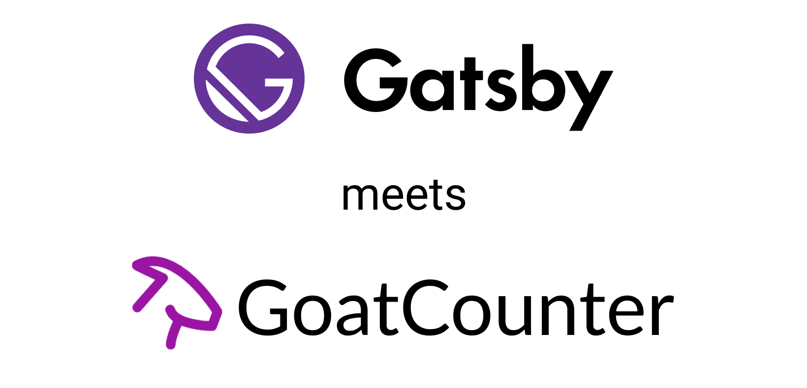

> This article has been imported from coding4.gaiama.org and is not necessarily up to date!

# 📈 GoatCounter & gatsby-plugin-goatcounter

I was seriously almost about to start a custom analytics SaaS product as none of the existing solutions satisfy my desires.

Until I finally stumbled upon the pretty new contender in the game called [GoatCounter]. It's still kinda early and very basic, yet the philosophy of the creator is what the world needs. 👍

I understand the idea of fully-fledged-privacy-invading-tracking-wherever-you-go-analytics. And it worked for a while. That doesn't mean we can realize it reached a point where reconsidering where we're heading might be appropriate. The future will come anyway. We just don't have to blindly continue everything we considered normal. 😉

GoatCounter doesn't use any cookies. So it's actually "just" a visit counter like back in the days ✌️

We're not really analytics people. Though we realized not even knowing estimates of what happens on our website is really a bummer.

## Custom proxy

I've set up a basic serverless Google Analytics (GA) proxy on [Now](https://now.sh). Which worked more or less, sending only anonymous data to GA. But as I was only interested in basic analytics I've always found GA to be pretty complicated so I never actually bothered looking at the numbers 😅

I just started using the new statistics here on Coding4GaiAma and yet have to implement it on GaiAma.org, which just got easier.

As I couldn't resist the opportunity for myself to keep things DRY, to give back and encourage more people to join a privacy loving future I didn't just installed GoatCounter as per the docs, but took the plugin route from the get go.

## gatsby-plugin-goatcounter

v0.2.0 has just been published a couple of hours ago. 🎉
Which, in addition to implementing the analytics script to be SSR ready and enabling it in "SPA mode" to count not only the first visit but every in app navigation.

It allows to send events via the `useGoatCounter` hook and can skip views either via the `exclude` option or via `localStorage`, for example to stop your own visits from being tracked.

A transparent 1 pixel GIF can be enabled via the `pixel` option.
So far the dashboard won't distinguish between js and non-js visits though.

## Upcoming features

- An OutboundLink component like [gatsby-plugin-google-analytics](https://github.com/gatsbyjs/gatsby/tree/master/packages/gatsby-plugin-google-analytics#outboundlink-component) has
- Inlining the goat.js script to prevent the extra request as it's tiny anyway. Probably providing an option.
- A way to distinguish between js & non-js visitors just because
- And maybe your feature if you're missing anything which makes sense to integrate 😉

## Find it on

- [GitHub](https://github.com/GaiAma/Coding4GaiAma/tree/master/packages/gatsby-plugin-goatcounter)
- [NPM](https://www.npmjs.com/package/gatsby-plugin-goatcounter)

[goatcounter]: https://www.goatcounter.com/
