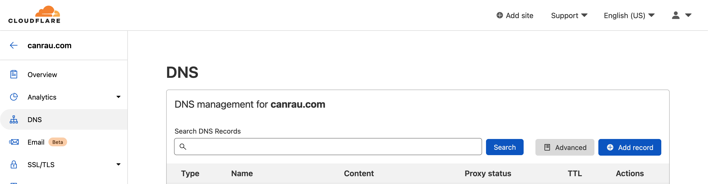

# {frontmatter.title}

> Note that some of the links in this Article are affiliate links, which means I might get a little compensation if you decide to sign-up. It won't change anything for you. ❤️

As I'm building my CMS I started today to work in the storage API for static assets like images.

I wanted to give [Backblaze B2](https://www.backblaze.com/b2/cloud-storage.html#af9xh2) a try though my current internet solution blocks a "few things" for whatever reasons, seems in this case that only some JS resources on B2's login site won't load which means I can't log in 😓 So I'm falling back to AWS S3 for now until I get that fixed 🤞

Anyway as I was setting up the bucket I wanted to map it to my own domain and decided it's finally time to get Cloudflare running

## Granting only Cloudflare access to AWS S3 private bucket

```json
{
  "Version": "2012-10-17",
  "Statement": [
    {
      "Sid": "AllowCloudFlareIP",
      "Effect": "Allow",
      "Principal": "*",
      "Action": "s3:getObject",
      "Resource": ["arn:aws:s3:::assets.canrau.com", "arn:aws:s3:::assets.canrau.com/*"],
      "Condition": {
        "IpAddress": {
          "aws:SourceIp": [
            "2400:cb00::/32",
            "2606:4700::/32",
            "2803:f800::/32",
            "2405:b500::/32",
            "2405:8100::/32",
            "2a06:98c0::/29",
            "2c0f:f248::/32",
            "173.245.48.0/20",
            "103.21.244.0/22",
            "103.22.200.0/22",
            "103.31.4.0/22",
            "141.101.64.0/18",
            "108.162.192.0/18",
            "190.93.240.0/20",
            "188.114.96.0/20",
            "197.234.240.0/22",
            "198.41.128.0/17",
            "162.158.0.0/15",
            "172.64.0.0/13",
            "131.0.72.0/22",
            "104.16.0.0/13",
            "104.24.0.0/14"
          ]
        }
      }
    }
  ]
}
```

## Fix SSL issues

Add a Page Rule to Cloudflare

```
assets.canrau.com/*
SSL: Flexible, Cache Level: Cache Everything
```

## Verify that Cloudflare is working

Using those sites I verified that Cloudflare is actually serving my website
https://www.cloudflare.com/diagnostic-center/
https://checkforcloudflare.selesti.com
Though developer tools in Firefox took a little longer to show Cloudflare headers and Brotli compression, which was probably due to Firefox caching DNS entries.

## Cloudflare Web Analytics and GDPR

As Cloudflare Web Analytics is not using cookies it is actually GDPR compliant without needing a cookie banner.

From the [docs](https://developers.cloudflare.com/analytics/web-analytics)

> Cloudflare Web Analytics provides free, privacy-first analytics for your website [..].

> Cloudflare Web Analytics does not collect or use your visitors’ personal data.

Also answered in [Cloudflare's Community](https://community.cloudflare.com/t/web-analytics-without-cookie-banner-gdpr-conform/238770/2)

## Gandi.net Mail with Cloudflare DNS

After logging into [admin.gandi.net](https://admin.gandi.net) and creating an email account, Gandi will show the required DNS settings (if you've already pointed your nameservers to Cloudflare).

> They're also available from Gandis Docs [MX Records](https://docs.gandi.net/en/domain_names/faq/record_types/mx_record.html), [DKIM, SPF, DMARC](https://docs.gandi.net/en/gandimail/common_operations/enable_antispoofing_tools.html) and more optional [SRV Records](https://docs.gandi.net/en/gandimail/standard_email_settings/index.html#srv-records). Note that even though Gandi specifically mentions the trailing dot, it works perfectly fine without as Cloudflare manages that during lookups ([reference comment in Cloudflare Community](https://community.cloudflare.com/t/i-could-not-receive-email-after-i-moved-my-dns-to-cloudflare/109431/2?u=canrau))

### Quick setup

The easiest way, also avoiding any typos or misconfigurations, is by copying the following into a `.txt` file, changing `dmarc-report@your.domain` in line 4 (beginning with `_dmarc`) to an email address of you choice and then in the [Cloudflare Dashboard](https://dash.cloudflare.com/) DNS settings of your domain, tap on **advanced** next to "Add record" and drag the saved and modified `.txt` file into the dashed area.

```txt
@ 10800 IN MX 10 spool.mail.gandi.net.
@ 10800 IN MX 50 fb.mail.gandi.net.
@ 10800 IN TXT "v=spf1 include:_mailcust.gandi.net ?all"
_dmarc 10800 IN TXT "v=DMARC1; p=quarantine; pct=25; rua=mailto:dmarc-report@your.domain"
_imap._tcp 10800 IN SRV 0 0 0   .
_imaps._tcp 10800 IN SRV 0 1 993 mail.gandi.net.
_pop3._tcp 10800 IN SRV 0 0 0   .
_pop3s._tcp 10800 IN SRV 10 1 995 mail.gandi.net.
_submission._tcp 10800 IN SRV 0 1 465 mail.gandi.net.
```



> Note to self, add API code example, maybe a Deno CLI and/or Pulumi script!

### Reference links

https://docs.gandi.net/en/domain_names/faq/record_types/mx_record.html
https://docs.gandi.net/en/gandimail/common_operations/enable_antispoofing_tools.html
https://community.cloudflare.com/t/i-could-not-receive-email-after-i-moved-my-dns-to-cloudflare/109431/4
https://community.cloudflare.com/t/problems-with-email-need-help/21183

## Resources

- [Is it possible to use Cloudflare + AWS S3 without setting up S3 static hosting?](https://community.cloudflare.com/t/is-it-possible-to-use-cloudflare-aws-s3-without-setting-up-s3-static-hosting/52711/13)
- [Configuring an Amazon Web Services static site to use Cloudflare](https://support.cloudflare.com/hc/en-us/articles/360037983412-Configuring-an-Amazon-Web-Services-static-site-to-use-Cloudflare)
