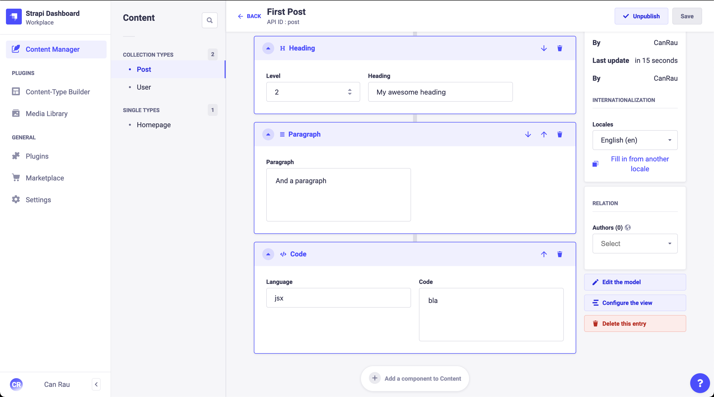
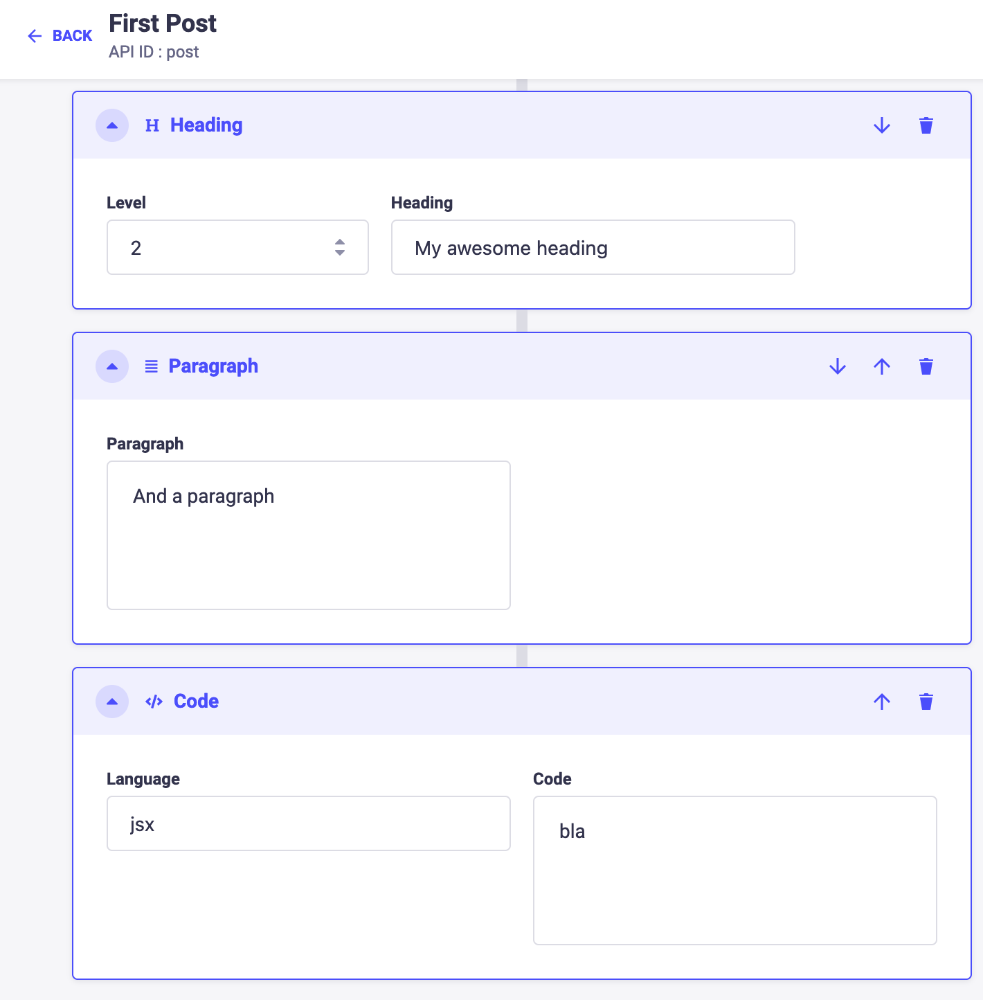

# {frontmatter.title}

{frontmatter.description}

## Table of contents

## Keystone JS

Kinda love it, though... 🤓

- no "real" slug field? 🤔 so how to query blog posts? only way seams a manual slug field or a custom field¿!
- dislike the slide-in pop-over when creating a new item, editing later is fine
- how to add images to wysiwyg¿?

Kay I just figured out a way of building it myself using [hooks](https://keystonejs.com/docs/guides/hooks)

```ts
export const lists: Lists = {
  Post: list({
    fields: {
      title: text(),
      slug: text({
        isIndexed: "unique",
      }),
    },
    hooks: {
      resolveInput: ({ resolvedData, item, inputData }) => {
        if (inputData.slug === "" || !item?.slug) {
          resolvedData.slug = resolvedData.title || item?.title || "";
        }
        if (resolvedData.slug) {
          resolvedData.slug = slugify(resolvedData.slug);
        }
        return resolvedData;
      },
    },
  }),
};
```

This behaves exactly as I think a `slug` field should. Initially (when empty) it'll be auto-populated on save from the title field. Later when updating the title it stays the same to not "break the site" but gives me the freedom to edit the slug however I see fit, or empty it to make it auto-generate from title field on save.

Also it should be possible to prevent it from changing if the item is already published, if that's a requirement, or send old, non-empty slugs to your redirection database to make sure it'll never end up in 404s.

I must say this hook system is really fantastic 👏

If I can now figure out how to add images to the `document` field (WYSIWYG) I might be convinced 🥰.
Solved the image problem in [How to add images to WYSIWYG in Keystone v6](en/how-to-add-images-to-wysiwyg-in-keystone-v6) 🥳

- [Getting started with create keystone app](https://keystonejs.com/docs/walkthroughs/getting-started-with-create-keystone-app)
- [How do I query my API for a single entity by its "slug" with GraphQL?](https://stackoverflow.com/questions/65829744/how-do-i-query-my-api-for-a-single-entity-by-its-slug-with-graphql)

## Strapi

Ridiculous field "styles", the widths aren't customizable and at least within Dynamic Zones most fields are half width 🤦🏻‍♂️

I mean




### Strapi related links

- [Official Strapi Website](https://strapi.io/)
- [Change width of fields on Edit page](https://forum.strapi.io/t/change-width-of-fields-on-edit-page/181/5)
- [Headless CMS and Strapi SEO best practices](https://strapi.io/blog/headless-cms-strapi-seo-best-practices)
- [Create is owner policy (Apply the author by default)](https://docs.strapi.io/developer-docs/latest/guides/is-owner.html)
- [Strapi - working with relationships and how to use Graphql for nested relations](https://www.youtube.com/watch?v=Rw9Xd89yC2o)
- [Run Strapi on existing server (e.g. Next.js)](https://forum.strapi.io/t/run-strapi-on-existing-server-e-g-next-js/8777/1)
- [How to: Strapi GraphQL mutation with dynamic zones/component](https://stackoverflow.com/a/61376901/3484824)
- [How to Create Pages on the fly with Dynamic Zone](https://strapi.io/blog/how-to-create-pages-on-the-fly-with-dynamic-zone)
- [Strapi CMS v4 Custom Field Type Renderer](https://www.youtube.com/watch?v=3of3s_xhEnE)
- [Strapi Security Checklist](https://strapi.io/blog/strapi-security-checklist)
- [How to Build a Notion Clone With Strapi and Next.js 1/2](https://strapi.io/blog/how-to-build-a-notion-clone-with-strapi-and-next-js)
- [Handle previews in a headless architecture](https://strapi.io/blog/handling-previews-in-a-headless-architecture)
- [How to Setup & Use Strapi to Store your app's logs](https://strapi.io/blog/how-to-setup-and-use-strapi-to-store-your-app-s-logs)
- [Create a Url Shortener using NextJs, Tailwind CSS and Strapi](https://strapi.io/blog/create-a-url-shortener-using-next-js-tailwind-css-and-strapi)
- [Strapi V4 search by slug instead ID](https://forum.strapi.io/t/strapi-v4-search-by-slug-instead-id/13469)
- [Strapi plugin gutenberg-editor](https://github.com/renrizzolo/strapi-plugin-gutenberg-editor)
- [How to change the WYSIWYG in Strapi](https://strapi.io/blog/how-to-change-the-wysiwyg-in-strapi)
- [Admin Panel API for plugins](https://docs.strapi.io/developer-docs/latest/developer-resources/plugin-api-reference/admin-panel.html)
- []()

### REST API Example

```
http://localhost:1337/api/posts?publicationState=preview&populate=*&filters[slug][$eq]=erster-artikel&locale=de
```

### GraphQL Example

```gql
{
  posts(
    publicationState: PREVIEW
    filters: { slug: { eq: "first-blog-post-due" } }
    pagination: { limit: 1 }
  ) {
    __typename
    data {
      id
      attributes {
        createdAt
        publishedAt
        Title
        Content {
          __typename
          ... on ComponentContentHeading {
            id
            Heading
            Level
          }
          ... on ComponentContentParagraph {
            id
            Paragraph
          }
          ... on ComponentContentQuote {
            id
            Quote
            Source
          }
          ... on ComponentContentCode {
            id
            Code
          }
          ... on ComponentContentList {
            id
          }
        }
      }
    }
  }
}
```

## Directus

[Directus Website](https://directus.io)

- Currently (v9.5.1) missing an integrated way for a linked slug field. 🤯 [#4231](https://github.com/directus/directus/discussions/4231)
- Images show as broken once added to wysiwyg editor [#10469](https://github.com/directus/directus/issues/10469)

## ApostropheCMS

[ApostropheCMS Website](https://apostrophecms.com/) [ApostropheCMS Repo](https://github.com/apostrophecms/apostrophe)

## CraftCMS

[CraftCMS Website](https://craftcms.com)
It's PHP, but I especially don't like the restriction on having only a "Single admin account" in the free version, although I kinda get the idea 😇

Best way to try it locally is [Craft Nitro](https://craftcms.com/docs/nitro), though I haven't actually tried it 😅
