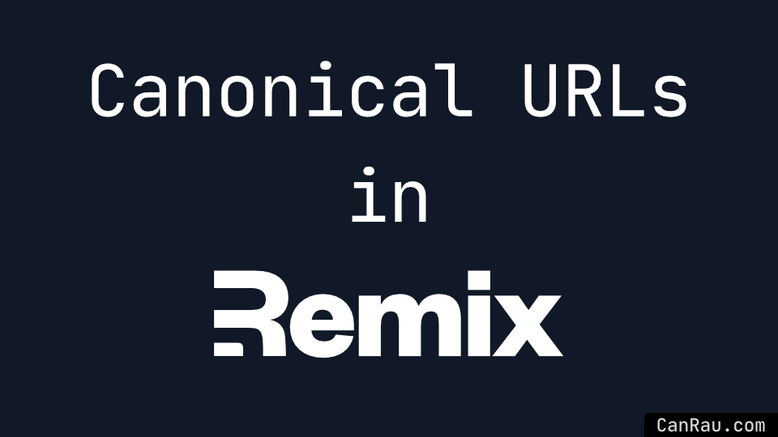
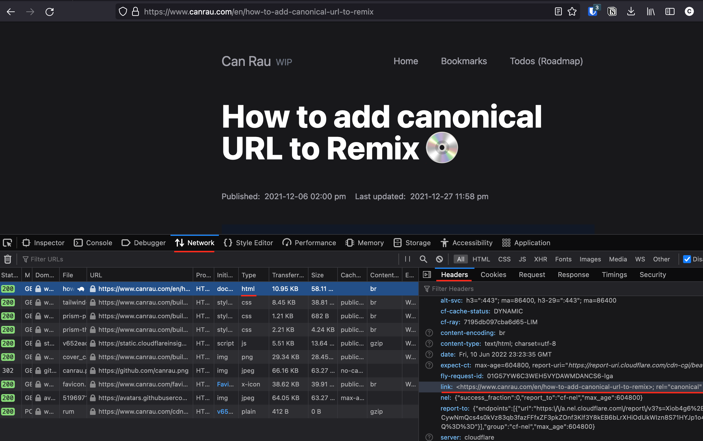

import coverImage from "./cover_canonical-urls-remix_s.png";
export const cover = coverImage;

export const jsonld = {
  "@context": "https://schema.org",
  "@type": "Article",
  headline: "How to add canonical URL to Remix 💿 (Updated Version)",
  description:
    "Add canonical urls to you Remix website to avoid duplicate content penalties for better SEO - Now with more examples",
  primaryImageOfPage: {
    "@context": "https://schema.org",
    "@type": "ImageObject",
    contentUrl: coverImage,
    description: "Cover showing the title with the full Remix logo instead of the word Remix",
  },
  image: [coverImage],
  dateCreated: "2021-12-06T14:00:00",
  dateModified: "2021-12-27T23:58:00",
  datePublished: "2021-12-06T14:00:00",
  author: [
    {
      "@type": "Person",
      name: "Can Rau",
      url: "https://twitter.com/CanRau",
      gender: "Male",
      birthDate: "1988-1-17",
      birthPlace: "Berlin, Germany",
    },
  ],
};

# {frontmatter.title}



> There's so far 2 ways I like.

## Table of contents

## Why canonical URLs

In general Google and other search engines are pretty good at consolidating duplicate content as websites are usually accessible via at least 2 distinct URLs as you can open a page with (site.com/article/) and without a trailing slash (site.com/article), those are 2 different URLs and therefore technically duplicate content, though search engines understand this and won't punish you.

Also some pages might be accessible with and without `www` and using `http` and `https`.

As a best practice I tend to redirect my pages to always use `https` so no-one get's a non-secure version and also redirect to include `www`, which I picked up somewhen somewhere and has something to do with cookies, I think about being able to have cookieless subdomains or something, when we used to serve static content from subdomain like `assets.example.io` etc.

To help search engines desice which of all those various versions is your prefered URL they redirect to, it's better to provide one and make sure you don't get any duplicate content issue.

So make sure, whatever way you use or prefer, to be consistent and always serve the same canonical URL so it won't change during renders and choose first if you want the canonical URL to be [with or without a trailing slash](/en/with-or-without-trailing-slash) and always use the absolute URL including the host like `https://www.canrau.com/en/how-to-add-canonical-url-to-remix` instead of `/en/how-to-add-canonical-url-to-remix`.

Also I read that some suggest to just add the canonical `<link/>` tag to the body within the routes component, which is actually [disallowed by Google](https://developers.google.com/search/blog/2013/04/5-common-mistakes-with-relcanonical#mistake-5:-rel=canonical-in-the-body)

## Using `loader` data

This one is probably my fav, as it doesn't require any other function than the most probably already present `loader`. And because it's part of the loader it gives me full access to the already fetched content 🥰

```ts
import { homepage } from "/package.json"; // or import from some kind of "/config"
export const loader: LoaderFunction = async ({ params }) => {
  // [..]
  const { frontmatter, code } = await bundleMDX();
  // [..]
  const canonical = `${homepage}/${frontmatter?.lang}${frontmatter?.slug}`;
  return { frontmatter, code, canonical };
};
```

Then in my `root.tsx` I have the following `Document` component, where especially lines 12 - 14 and line 23 are relevant.

```tsx
function Document({
  children,
  title,
  lang,
}: {
  children: ReactNode;
  title?: string;
  lang: string;
}) {
  // use `export const handle = { hydrate: true };` in any route to enable JS
  const includeScripts = useShouldHydrate(); // from remix-utils
  const matches = useMatches();
  const match = matches.find((match) => match.data && match.data.canonical);
  const canonical = match?.data.canonical;

  return (
    <html lang={lang} className="dark scroll-smooth">
      <head>
        <meta charSet="utf-8" />
        <meta name="viewport" content="width=device-width,initial-scale=1" />
        {title ? <title>{title}</title> : null}
        <Meta />
        {!!canonical && <link rel="canonical" href={canonical} />}
        <Links />
        <link
          rel="alternate"
          type="application/rss+xml"
          href={`${rootUrl}/${lang}/feed.xml`}
          title="Can Rau's XML Feed"
        />
        <link
          rel="alternate"
          type="application/feed+json"
          href={`${rootUrl}/${lang}/feed.json`}
          title="Can Rau's JSON Feed"
        />
      </head>
      <body className="dark:bg-gray-900">
        {children}
        <ScrollRestoration />
        {includeScripts && <Scripts />}
        {process.env.NODE_ENV === "development" && <LiveReload />}
      </body>
    </html>
  );
}
```

> Note: More about the `<link rel="alternate" />` in my other article [RSS in Remix](/en/rss-in-remix)

## Setting the `Link` header

Alternatively, or additionally (like I'm doing), instead of adding a `<link/>` element to your `<head/>` it's also possible to add a HTTP header which defines your canonical URL.

```
Link: <https://www.canrau.com/en/accessibility>; rel="canonical"
```

I use the following code in my `entry.server.tsx`

```tsx
export default async function handleRequest(
  request: Request,
  responseStatusCode: number,
  responseHeaders: Headers,
  remixContext: EntryContext,
) {
  const { matches, routeData } = remixContext;

  const match = matches.find((m) => m.pathname === url.pathname);

  const canonical = match?.route?.id && routeData?.[match.route.id]?.canonical;

  let markup = renderToString(<RemixServer context={remixContext} url={request.url} />);

  responseHeaders.set("Content-Type", "text/html");

  if (canonical) {
    responseHeaders.set("Link", `<${canonical}>; rel="canonical"`);
  }

  return new Response("<!DOCTYPE html>" + markup, {
    status: responseStatusCode,
    headers: responseHeaders,
  });
}
```

More about useMatches in the [Remix Package docs](https://remix.run/docs/en/v1/api/remix#usematches) and in the [Disabling Javscript docs](https://remix.run/docs/en/v1/guides/disabling-javascript)

### Verify the response header is set correctly



You can also check response headers using tools like [geekflare.com/tools/http-headers-test](https://geekflare.com/tools/http-headers-test).

Also thanks to [@\_RecoveryOcean](https://twitter.com/_RecoveryOcean) I just stumbled upon a great read: [Why the rel=”canonical” HTTP Header is faster than the rel=”canonical” HTML tag](https://gentofsearch.com/blog/canonical-tag-vs-rel-canonical-http-header/). Which I kinda suspected, at least it makes sense as to read the HTML meta tag the crawler/spider/bot whatever has to parse or RegEx search the HTML, at least partially, whereas the HTTP header is kinda right there. 💁🏻‍♂️

## Bonus: Using the `links` export

As Remix doesn't provide the `loader`s data to the `links` function anymore, as they had to [remove it for prefetching](https://discord.com/channels/770287896669978684/771068344320786452/907715068303642655), this one is less appealing or even not usable, when dealing with dynamic data in a single route file.

But if your writing your pages in `mdx` or `tsx` directly, you can also statically define your canonical `<link/>` as follows

```tsx
import { type LinksFunction } from "remix";
export let links: LinksFunction = () => {
  return [{ rel: "canonical", href: "https://www.example.io/my-canonical-url" }];
};
```

## Bonus: Using a custom route `handle`

I started using this one, when I realized it feels like unnecessarily passing data back and forth and the first 2 options feel just cleaner, after discovering them 🤓

Instead of using a `loader` to return your canonical url, you can export a `handle` from your routes like so

```jsx
export const handle: RouteHandle = {
  canonical: "https://www.example.co/canonical-url",
};
```

which you then get in your `root.tsx`

```jsx
const matches = useMatches();
const canonical = matches.find((match) => match.handle && match.handle.canonical);

// then within your Document
<head>{!!canonical && <link rel="canonical" href={canonical} />}</head>;
```

or using a function which can receive whatever data you pass in from your `root.tsx` when receiving/calling it

```jsx
// in a route file
export const handle: RouteHandle = {
  canonical: ({ lang, slug, host }: { lang: string, slug: string, host: string }) =>
    `${host}/${lang}/${slug}`,
};
```

then in your `root.tsx`

```tsx
const { lang, slug } = useParams<"lang" | "slug">();
const match = useMatches().find((match) => match.handle && match.handle.canonical);
const canonical = match?.handle.canonical({
  lang,
  slug,
  host: "https://www.example.co",
});
```

It's also possible to combine the last to examples and pass data in if the canonical handle is a function, otherwise just use it.

In this example it doesn't actually make much sense to pass data back and forth like this, at least to me.

But there might be of course reasons/use cases to do so. I want to share all the possibilities I came up with so you can pick the best one for your needs 🤝

## Related links

- [Consolidate duplicate URLs](https://developers.google.com/search/docs/advanced/crawling/consolidate-duplicate-urls)
- [Mistake 5: rel=canonical in the <body/> - 5 common mistakes with rel=canonical](https://developers.google.com/search/blog/2013/04/5-common-mistakes-with-relcanonical#mistake-5:-rel=canonical-in-the-body)
- [​Canonical outside of head](https://sitebulb.com/hints/indexability/canonical-outside-of-head/)
- [Canonical URL / Location Checker](https://www.seoreviewtools.com/canonical-url-location-checker/)
