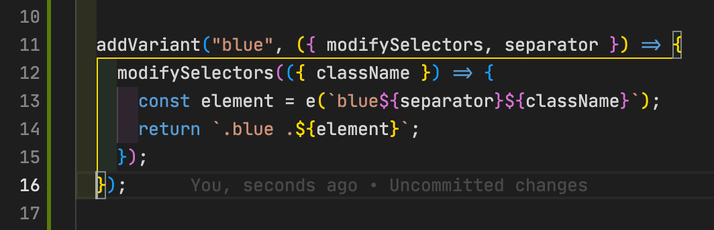

{/* export { default as cover } from "./cover_gracefully-close-sub-subprocess-using-signals-in-deno_s.png"; */}

# {frontmatter.title}

## Table of contents

## Bracket pair highlighting


Screenshot from the plugins' readme

Since using VSCode I used the [Bracket-Pair-Colorizer-2](https://github.com/CoenraadS/Bracket-Pair-Colorizer-2) plugin to make it easier to follow brackets.

Though couple of minutes ago (2021-12-16 00:20 GMT-5) a little VSCode notification popped up telling me `Bracket-Pair-Colorizer-2` is now unmaintained 😢

Luckily curious me clicked the provided link to get more details which took me to the plugins readme with a nice little info (congrats to such a successfull plugin 🥳) and [how to enable the now natively included bracket highlighting](https://github.com/CoenraadS/Bracket-Pair-Colorizer-2#how-to-enable-native-bracket-matching).

So I uninstalled the plugin (also v1 which I had just disabled 🧐) and added the following to my `settings.json`

```json
{
  "editor.bracketPairColorization.enabled": true,
  "editor.guides.bracketPairs": "active"
}
```

which yields an even more satisfying result, at least for my liking 🥰


Screenshot of a little TailwindCSS plugin I wrote to help a fellow Tailwindian in the [GitHub discussions](https://github.com/tailwindlabs/tailwindcss/discussions/6547)

> More settings to follow, so stay tuned to make your development workflow more pleasant 😉
