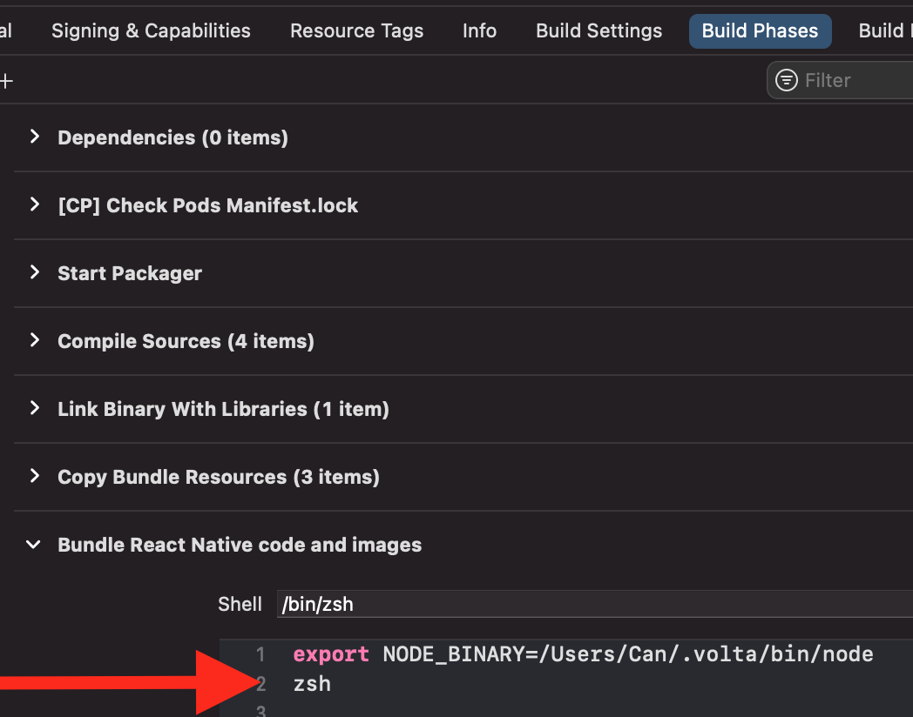

## Create a separate Apple ID

Using a new user on my MacBook

[my comment](https://stackoverflow.com/questions/66627590/phasescriptexecution-error-in-react-native-app/67035460#comment127160063_67035460)
[Bundle ID assigned to personal tea… | Apple Developer Forums](https://developer.apple.com/forums/thread/107350)
[Can I transfer my app after removi… | Apple Developer Forums](https://developer.apple.com/forums/thread/81028)
[Should I use my personal Apple ID for development or create a new one?](https://apple.stackexchange.com/questions/75730/should-i-use-my-personal-apple-id-for-development-or-create-a-new-one)
[Should I make a separate Apple ID for the iOS development program? : iOSProgramming](https://www.reddit.com/r/iOSProgramming/comments/1be9ct/should_i_make_a_separate_apple_id_for_the_ios/)
[For indie developers - separate Ap… | Apple Developer Forums](https://developer.apple.com/forums/thread/672258)
[Should I use my personal Apple ID for development or create a new one?](https://apple.stackexchange.com/questions/75730/should-i-use-my-personal-apple-id-for-development-or-create-a-new-one)

## XCode with Volta

At the moment I'm running `zsh` (to re-initiate ZSH) in XCode build phase as shown in the following screenshot

## Some more thoughts

If you plan on selling your app at some point or think it might happen, it seems crucial to follow some requirements when you want to transfer your app to another developer later on as mentioned in: "[Can I transfer my app after removing iCloud and subscription implementation?](https://developer.apple.com/forums/thread/81028)"

## Clean React Native Project

https://stackoverflow.com/questions/48018988/clean-react-native-project
