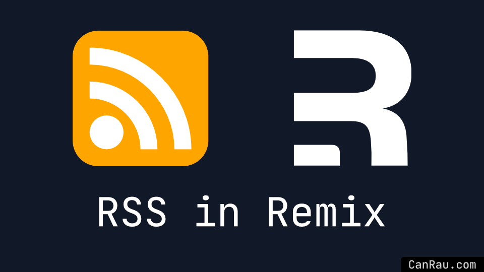
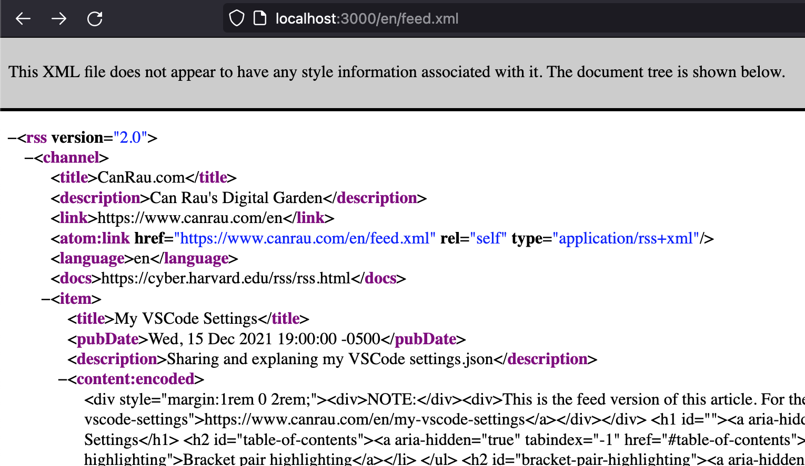
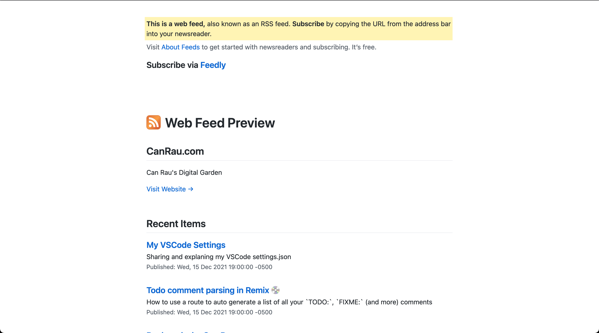

export { default as cover } from "./cover_rss-in-remix_s.png";

import { RssIcon } from "~/components/icons/rss";

# {frontmatter.title}

> TL;DR {frontmatter.description}



## Why RSS, isn't it dead?

I myself plan to use RSS more, as the flood of newsletters starts to get a little invasive and I feel like checking a newsreader whenever I feel like and keeping my inbox a little cleaner sounds great. I won't stop newsletters completely, though I don't have to subscribe to everything via mail anymore.

And when using it myself it makes a lot of sense to me, to also provide this possibility to others, along my newsletter.

While researching for this article I stumbled upon the following which I'll just quote here

> Between Google Chrome experimenting with "following" sites, along with a growing frustration of how social media platforms limit a creator's reach to their fans through algorithmic feeds, there's been renewed interest in RSS feeds and they're primed for a comeback as we get into 2022. — [CSS-Tricks](https://css-tricks.com/working-with-web-feeds-its-more-than-rss/)

And this is from the before mentioned "Google Chrome experimenting with 'following' sites".

> Keeping a site’s RSS up-to-date will ensure Chrome can provide the latest content to users with this experiment. — [Chromium Blog](https://blog.chromium.org/2021/05/an-experiment-in-helping-users-and-web.html)

Also I like to add my site to [Google Search Console](https://search.google.com/search-console), which you do by providing your sitemap feed links, which also makes it much easier and quicker for Google to index your site. Those sitemaps can simply be your existing RSS 2.0 feeds — so RSS === SEO Win 🥳 [supported sitemap formats](https://developers.google.com/search/docs/advanced/sitemaps/build-sitemap#sitemapformat). Though while you're adding your RSS feed, you can also provide an additional XML sitemap, which are smaller, as you don't include the full content, just the links and they provide [extensions](https://developers.google.com/search/docs/advanced/sitemaps/build-sitemap#extensions) which allow you to tell search engines about images, videos and Google News sitemaps.
[Jump to example sitemap below](#xml-sitemap-for-search-engines)

So providing RSS feeds, even in 2022, sounds like a really good idea to me 🤓

## I Love Remix!

I can just use [Resource Routes](https://remix.run/docs/en/v1/guides/resource-routes) to generate web-feeds on the fly 🥳

## Table of contents

## The feed routes

So I've got a route for each syndication format, in my case so far [RSS2](/en/feed.xml) and [JSON](/en/feed.json) (click for example feeds). Personally I'd prefer to only use `json` because it's just less messy, but hey 🤷🏻‍♂️😅

To get routes with a `.` dot working, we have to escape it like so `feed[.]xml.tsx` or alternatively `[feed.xml].tsx` so the url path ends up like `/feed.xml`, otherwise Remix considers it a subroute without inheriting the layout. More on [Dot Delimeters](https://remix.run/docs/en/v1/api/conventions#dot-delimeters) and [Escaping special characters](https://remix.run/docs/en/v1/api/conventions#escaping-special-characters) in Remix.

As I plan to have my website multilanguage I've put my feed routes into

```bash
├── app
│   ├── routes
│   │   ├── $lang
│   │   │   ├── feed[.]json.tsx
│   │   │   └── feed[.]xml.tsx
```

## The concept

Let's start with the more widely used and supported RSS 2 XML feed.

As we just want a resource route to render custom stuff to the frontend, we only need to export a `loader` function returning the XML string along some headers to ensure everyone understands the content correctly.

```ts
export const loader: LoaderFunction = async () => {
  return new Response("<THE ACTUAL XML/>", {
    headers: {
      "Content-Type": "application/xml; charset=utf-8",
      "x-content-type-options": "nosniff",
    },
  });
};
```

There's various ways on how you can go about generating the XML. The first way I'll show you is doing it manually. The second is using [feed](https://github.com/jpmonette/feed) which only requires an object containing the data and renders everything else for you. This might be more convenient, but is also more limited.

## Full code of my `feed[.]xml.tsx`

```tsx
import { type LoaderFunction } from "remix";
import formatDate from "date-fns/format";
import type { Lang } from "/types";
import { renderToString } from "react-dom/server";
import { getMDXComponent } from "mdx-bundler/client";
import { getPostsList } from "~/utils/mdx.server";
import { NotFoundError } from "~/utils/error-responses";
import { defaultLang, languages, rootUrl } from "/config";

export const loader: LoaderFunction = async ({ params }) => {
  const lang = (params.lang || defaultLang) as Lang;
  if (!languages.includes(lang)) {
    throw NotFoundError();
  }

  const posts = await getPostsList({ lang }).catch(() => {
    throw NotFoundError(lang);
  });

  const postItems = posts
    .filter((post) => post.status === "published")
    .map((post) => {
      const feedNote: Record<Lang, string> = {
        en: `<div style="margin:1rem 0 2rem;"><div>NOTE:</div><div>This is the feed version of this article. For the full experience consider viewing it from your browser <a href="${post.canonical}">${post.canonical}</a></div></div>`,
      };
      const Comp = getMDXComponent(post.mdx);
      const html = `${feedNote[post.lang]}${renderToString(<Comp />)}`;
      const tagDate = formatDate(post.created, "yyyy-mm-dd");
      return [
        `<item>`,
        `<title>${post.title}</title>`,
        `<pubDate>${pubDate(post.published)}</pubDate>`,
        `<description><![CDATA[${post.description}]]></description>`,
        `<content:encoded><![CDATA[${html}]]></content:encoded>`,
        `<link>${post.canonical}</link>`,
        `<guid isPermaLink="false">tag:${domain},${tagDate}:${post.lang}/${post.slug}#</guid>`,
        `</item>`,
      ].join("");
    });

  const rss = [
    `<?xml version="1.0" encoding="UTF-8"?>`,
    `<?xml-stylesheet href="/${lang}/pretty-feed-v3.xsl" type="text/xsl"?>`,
    `<rss version="2.0" xmlns:dc="http://purl.org/dc/elements/1.1/" xmlns:content="http://purl.org/rss/1.0/modules/content/" xmlns:atom="http://www.w3.org/2005/Atom" xmlns:sy="http://purl.org/rss/1.0/modules/syndication/">`,
    `<channel>`,
    `<title>CanRau.com</title>`,
    `<description>Can Rau's Digital Garden</description>`,
    `<link>${rootUrl}/${lang}</link>`,
    `<atom:link href="${rootUrl}/${lang}/feed.xml" rel="self" type="application/rss+xml" />`,
    `<language>${lang}</language>`,
    `<docs>https://cyber.harvard.edu/rss/rss.html</docs>`,
    `<sy:updatePeriod>daily</sy:updatePeriod>`, // can be one of: hourly | daily | weekly | monthly | yearly
    ...postItems,
    `</channel>`,
    `</rss>`,
  ];

  return new Response(rss.join(""), {
    headers: {
      "Content-Type": "application/xml; charset=utf-8",
      "x-content-type-options": "nosniff",
    },
  });
};

/**
 * Get an RSS pubDate from a Javascript Date instance.
 * @param Date - optional
 * @return String
 *
 * from https://gist.github.com/samhernandez/5260558
 * more about [RFC822](https://datatracker.ietf.org/doc/html/rfc822)
 */
function pubDate(date: Date) {
  if (typeof date === "undefined") {
    date = new Date();
  }

  const pieces = date.toString().split(" ");
  const offsetTime = pieces?.[5]?.match(/[-+]\d{4}/);
  const offset = offsetTime ? offsetTime : pieces[5];
  const parts = [
    pieces[0] + ",",
    pieces[2],
    pieces[1],
    pieces[3],
    pieces[4],
    offset,
  ];

  return parts.join(" ");
}
```

> There's a lot more you can do in XML and RSS2, to get an idea of what's possible check out the [RSS 2.0 Spec](https://cyber.harvard.edu/rss/rss.html)

I "designed" the `<guid/>` inspired by [this CSS-Tricks](https://css-tricks.com/working-with-web-feeds-its-more-than-rss/#moving-feeds) article

You might have noticed the `?xml-stylesheet` 🤔

I just disabled it on this site as I'm actually still not completely sure about it, many don't seem to provide a stylesheet which then looks like this



Using the stylesheet, in this case [PrettyFeed](https://github.com/genmon/aboutfeeds/blob/main/tools/pretty-feed-v3.xsl) which I got inspired to use by [Tom Critchlow](https://tomcritchlow.com/feed.xml) results in the following output



I'm unsure about the usefulness, as the feed is meant to be consumed by machines (bots), which aren't using this stylesheet anyway (as far as I know) and instead show the content in their prefered distraction free design, which will then be consumed by the reader. Also the pretty-feed file mentions in a code comment

> Styling the feed _prevents_ the browser from automatically opening a newsreader application. This is a trade off, but it's a benefit to new users who won't have a newsreader installed, and they are saved from seeing or downloaded obscure XML content. For existing newsreader users, they will know to copy-and-paste the feed URL, and they get the benefit of an in-browser feed preview.

So I feel I might disable the stylesheet soonish, just wanted to keep it in this article to show what's possible with XML and Remix [Resource Routes](https://remix.run/docs/en/v1/guides/resource-routes), as I'm showing to you how I generate the stylesheet dynamically depending on the URL language next.

Let's add `pretty-feed-v3[.]xsl.ts` to our `$lang` routes, to make use of the `lang` `param`.

```bash
├── app
│   ├── routes
│   │   ├── $lang
│   │   │   ├── feed[.]json.tsx
│   │   │   ├── feed[.]xml.tsx
│   │   │   └── pretty-feed-v3[.]xsl.ts
```

## Full code of my `pretty-feed-v3[.]xsl.ts`

```ts
import { type LoaderFunction } from "remix";
import type { Lang } from "/types";
import { NotFoundError } from "~/utils/error-responses";
import { defaultLang, languages, rootUrl } from "/config";

export const loader: LoaderFunction = async ({ params }) => {
  const lang = (params.lang || defaultLang) as Lang;
  if (!languages.includes(lang)) {
    throw NotFoundError();
  }

  const feedUrl = `${rootUrl}/${lang}/feed.xml`;

  const xml = `<?xml version="1.0" encoding="utf-8"?>
  <!--
  
  # Pretty Feed
  
  Styles an RSS/Atom feed, making it friendly for humans viewers, and adds a link
  to aboutfeeds.com for new user onboarding. See it in action:
  
     http://interconnected.org/home/feed
  
  
  ## How to use
  
  1. Download this XML stylesheet from the following URL and host it on your own
     domain (this is a limitation of XSL in browsers):
  
     https://github.com/genmon/aboutfeeds/blob/main/tools/pretty-feed-v3.xsl
  
  2. Include the XSL at the top of the RSS/Atom feed, like:
  
  \`\`\`
  <?xml version="1.0" encoding="UTF-8"?>
  <?xml-stylesheet href="/PATH-TO-YOUR-STYLES/pretty-feed-v3.xsl" type="text/xsl"?>
  \`\`\`
  
  3. Serve the feed with the following HTTP headers:
  
  \`\`\`
  Content-Type: application/xml; charset=utf-8  # not application/rss+xml
  x-content-type-options: nosniff
  \`\`\`
  
  (These headers are required to style feeds for users with Safari on iOS/Mac.)
  
  
  
  ## Limitations
  
  - Styling the feed *prevents* the browser from automatically opening a
    newsreader application. This is a trade off, but it's a benefit to new users
    who won't have a newsreader installed, and they are saved from seeing or
    downloaded obscure XML content. For existing newsreader users, they will know
    to copy-and-paste the feed URL, and they get the benefit of an in-browser feed
    preview.
  - Feed styling, for all browsers, is only available to site owners who control
    their own platform. The need to add both XML and HTTP headers makes this a
    limited solution.
  
  
  ## Credits
  
  pretty-feed is based on work by lepture.com:
  
     https://lepture.com/en/2019/rss-style-with-xsl
  
  This current version is maintained by aboutfeeds.com:
  
     https://github.com/genmon/aboutfeeds
  
  
  ## Feedback
  
  This file is in BETA. Please test and contribute to the discussion:
  
       https://github.com/genmon/aboutfeeds/issues/8
  
  -->
  <xsl:stylesheet version="3.0" xmlns:xsl="http://www.w3.org/1999/XSL/Transform"
                  xmlns:atom="http://www.w3.org/2005/Atom" xmlns:dc="http://purl.org/dc/elements/1.1/"
                  xmlns:itunes="http://www.itunes.com/dtds/podcast-1.0.dtd">
    <xsl:output method="html" version="1.0" encoding="UTF-8" indent="yes"/>
    <xsl:template match="/">
      <html xmlns="http://www.w3.org/1999/xhtml">
        <head>
          <title><xsl:value-of select="/rss/channel/title"/> Web Feed</title>
          <meta http-equiv="Content-Type" content="text/html; charset=utf-8"/>
          <meta name="viewport" content="width=device-width, initial-scale=1, maximum-scale=1"/>
          <style type="text/css">/*! normalize.css v4.1.1 | MIT License | github.com/necolas/normalize.css */html{font-family:sans-serif;-ms-text-size-adjust:100%;-webkit-text-size-adjust:100%}body{margin:0}article,aside,details,figcaption,figure,footer,header,main,menu,nav,section{display:block}summary{display:list-item}audio,canvas,progress,video{display:inline-block}audio:not([controls]){display:none;height:0}progress{vertical-align:baseline}[hidden],template{display:none!important}a{background-color:transparent}a:active,a:hover{outline-width:0}abbr[title]{border-bottom:none;text-decoration:underline;text-decoration:underline dotted}b,strong{font-weight:inherit}b,strong{font-weight:bolder}dfn{font-style:italic}h1{font-size:2em;margin:.67em 0}mark{background-color:#ff0;color:#000}small{font-size:80%}sub,sup{font-size:75%;line-height:0;position:relative;vertical-align:baseline}sub{bottom:-.25em}sup{top:-.5em}img{border-style:none}svg:not(:root){overflow:hidden}code,kbd,pre,samp{font-family:monospace,monospace;font-size:1em}figure{margin:1em 40px}hr{box-sizing:content-box;height:0;overflow:visible}button,input,select,textarea{font:inherit;margin:0}optgroup{font-weight:700}button,input{overflow:visible}button,select{text-transform:none}[type=reset],[type=submit],button,html [type=button]{-webkit-appearance:button}[type=button]::-moz-focus-inner,[type=reset]::-moz-focus-inner,[type=submit]::-moz-focus-inner,button::-moz-focus-inner{border-style:none;padding:0}[type=button]:-moz-focusring,[type=reset]:-moz-focusring,[type=submit]:-moz-focusring,button:-moz-focusring{outline:1px dotted ButtonText}fieldset{border:1px solid silver;margin:0 2px;padding:.35em .625em .75em}legend{box-sizing:border-box;color:inherit;display:table;max-width:100%;padding:0;white-space:normal}textarea{overflow:auto}[type=checkbox],[type=radio]{box-sizing:border-box;padding:0}[type=number]::-webkit-inner-spin-button,[type=number]::-webkit-outer-spin-button{height:auto}[type=search]{-webkit-appearance:textfield;outline-offset:-2px}[type=search]::-webkit-search-cancel-button,[type=search]::-webkit-search-decoration{-webkit-appearance:none}::-webkit-input-placeholder{color:inherit;opacity:.54}::-webkit-file-upload-button{-webkit-appearance:button;font:inherit}*{box-sizing:border-box}button,input,select,textarea{font-family:inherit;font-size:inherit;line-height:inherit}body{font-family:-apple-system,BlinkMacSystemFont,"Segoe UI",Helvetica,Arial,sans-serif,"Apple Color Emoji","Segoe UI Emoji","Segoe UI Symbol";font-size:14px;line-height:1.5;color:#24292e;background-color:#fff}a{color:#0366d6;text-decoration:none}a:hover{text-decoration:underline}b,strong{font-weight:600}.rule,hr{height:0;margin:15px 0;overflow:hidden;background:0 0;border:0;border-bottom:1px solid #dfe2e5}.rule::before,hr::before{display:table;content:""}.rule::after,hr::after{display:table;clear:both;content:""}table{border-spacing:0;border-collapse:collapse}td,th{padding:0}button{cursor:pointer;border-radius:0}[hidden][hidden]{display:none!important}details summary{cursor:pointer}details:not([open])>* :not(summary){display:none!important}h1,h2,h3,h4,h5,h6{margin-top:0;margin-bottom:0}h1{font-size:32px;font-weight:600}h2{font-size:24px;font-weight:600}h3{font-size:20px;font-weight:600}h4{font-size:16px;font-weight:600}h5{font-size:14px;font-weight:600}h6{font-size:12px;font-weight:600}p{margin-top:0;margin-bottom:10px}small{font-size:90%}blockquote{margin:0}ol,ul{padding-left:0;margin-top:0;margin-bottom:0}ol ol,ul ol{list-style-type:lower-roman}ol ol ol,ol ul ol,ul ol ol,ul ul ol{list-style-type:lower-alpha}dd{margin-left:0}code,tt{font-family:SFMono-Regular,Consolas,"Liberation Mono",Menlo,Courier,monospace;font-size:12px}pre{margin-top:0;margin-bottom:0;font-family:SFMono-Regular,Consolas,"Liberation Mono",Menlo,Courier,monospace;font-size:12px}.octicon{vertical-align:text-bottom}.anim-fade-in{animation-name:fade-in;animation-duration:1s;animation-timing-function:ease-in-out}.anim-fade-in.fast{animation-duration:.3s}@keyframes fade-in{0%{opacity:0}100%{opacity:1}}.anim-fade-out{animation-name:fade-out;animation-duration:1s;animation-timing-function:ease-out}.anim-fade-out.fast{animation-duration:.3s}@keyframes fade-out{0%{opacity:1}100%{opacity:0}}.anim-fade-up{opacity:0;animation-name:fade-up;animation-duration:.3s;animation-fill-mode:forwards;animation-timing-function:ease-out;animation-delay:1s}@keyframes fade-up{0%{opacity:.8;transform:translateY(100%)}100%{opacity:1;transform:translateY(0)}}.anim-fade-down{animation-name:fade-down;animation-duration:.3s;animation-fill-mode:forwards;animation-timing-function:ease-in}@keyframes fade-down{0%{opacity:1;transform:translateY(0)}100%{opacity:.5;transform:translateY(100%)}}.anim-grow-x{width:0%;animation-name:grow-x;animation-duration:.3s;animation-fill-mode:forwards;animation-timing-function:ease;animation-delay:.5s}@keyframes grow-x{to{width:100%}}.anim-shrink-x{animation-name:shrink-x;animation-duration:.3s;animation-fill-mode:forwards;animation-timing-function:ease-in-out;animation-delay:.5s}@keyframes shrink-x{to{width:0%}}.anim-scale-in{animation-name:scale-in;animation-duration:.15s;animation-timing-function:cubic-bezier(.2,0,.13,1.5)}@keyframes scale-in{0%{opacity:0;transform:scale(.5)}100%{opacity:1;transform:scale(1)}}.anim-pulse{animation-name:pulse;animation-duration:2s;animation-timing-function:linear;animation-iteration-count:infinite}@keyframes pulse{0%{opacity:.3}10%{opacity:1}100%{opacity:.3}}.anim-pulse-in{animation-name:pulse-in;animation-duration:.5s}@keyframes pulse-in{0%{transform:scale3d(1,1,1)}50%{transform:scale3d(1.1,1.1,1.1)}100%{transform:scale3d(1,1,1)}}.hover-grow{transition:transform .3s;backface-visibility:hidden}.hover-grow:hover{transform:scale(1.025)}.border{border:1px #e1e4e8 solid!important}.border-y{border-top:1px #e1e4e8 solid!important;border-bottom:1px #e1e4e8 solid!important}.border-0{border:0!important}.border-dashed{border-style:dashed!important}.border-blue{border-color:#0366d6!important}.border-blue-light{border-color:#c8e1ff!important}.border-green{border-color:#34d058!important}.border-green-light{border-color:#a2cbac!important}.border-red{border-color:#d73a49!important}.border-red-light{border-color:#cea0a5!important}.border-purple{border-color:#6f42c1!important}.border-yellow{border-color:#d9d0a5!important}.border-gray-light{border-color:#eaecef!important}.border-gray-dark{border-color:#d1d5da!important}.border-black-fade{border-color:rgba(27,31,35,.15)!important}.border-top{border-top:1px #e1e4e8 solid!important}.border-right{border-right:1px #e1e4e8 solid!important}.border-bottom{border-bottom:1px #e1e4e8 solid!important}.border-left{border-left:1px #e1e4e8 solid!important}.border-top-0{border-top:0!important}.border-right-0{border-right:0!important}.border-bottom-0{border-bottom:0!important}.border-left-0{border-left:0!important}.rounded-0{border-radius:0!important}.rounded-1{border-radius:3px!important}.rounded-2{border-radius:6px!important}.rounded-top-0{border-top-left-radius:0!important;border-top-right-radius:0!important}.rounded-top-1{border-top-left-radius:3px!important;border-top-right-radius:3px!important}.rounded-top-2{border-top-left-radius:6px!important;border-top-right-radius:6px!important}.rounded-right-0{border-top-right-radius:0!important;border-bottom-right-radius:0!important}.rounded-right-1{border-top-right-radius:3px!important;border-bottom-right-radius:3px!important}.rounded-right-2{border-top-right-radius:6px!important;border-bottom-right-radius:6px!important}.rounded-bottom-0{border-bottom-right-radius:0!important;border-bottom-left-radius:0!important}.rounded-bottom-1{border-bottom-right-radius:3px!important;border-bottom-left-radius:3px!important}.rounded-bottom-2{border-bottom-right-radius:6px!important;border-bottom-left-radius:6px!important}.rounded-left-0{border-bottom-left-radius:0!important;border-top-left-radius:0!important}.rounded-left-1{border-bottom-left-radius:3px!important;border-top-left-radius:3px!important}.rounded-left-2{border-bottom-left-radius:6px!important;border-top-left-radius:6px!important}@media (min-width:544px){.border-sm-top{border-top:1px #e1e4e8 solid!important}.border-sm-right{border-right:1px #e1e4e8 solid!important}.border-sm-bottom{border-bottom:1px #e1e4e8 solid!important}.border-sm-left{border-left:1px #e1e4e8 solid!important}.border-sm-top-0{border-top:0!important}.border-sm-right-0{border-right:0!important}.border-sm-bottom-0{border-bottom:0!important}.border-sm-left-0{border-left:0!important}.rounded-sm-0{border-radius:0!important}.rounded-sm-1{border-radius:3px!important}.rounded-sm-2{border-radius:6px!important}.rounded-sm-top-0{border-top-left-radius:0!important;border-top-right-radius:0!important}.rounded-sm-top-1{border-top-left-radius:3px!important;border-top-right-radius:3px!important}.rounded-sm-top-2{border-top-left-radius:6px!important;border-top-right-radius:6px!important}.rounded-sm-right-0{border-top-right-radius:0!important;border-bottom-right-radius:0!important}.rounded-sm-right-1{border-top-right-radius:3px!important;border-bottom-right-radius:3px!important}.rounded-sm-right-2{border-top-right-radius:6px!important;border-bottom-right-radius:6px!important}.rounded-sm-bottom-0{border-bottom-right-radius:0!important;border-bottom-left-radius:0!important}.rounded-sm-bottom-1{border-bottom-right-radius:3px!important;border-bottom-left-radius:3px!important}.rounded-sm-bottom-2{border-bottom-right-radius:6px!important;border-bottom-left-radius:6px!important}.rounded-sm-left-0{border-bottom-left-radius:0!important;border-top-left-radius:0!important}.rounded-sm-left-1{border-bottom-left-radius:3px!important;border-top-left-radius:3px!important}.rounded-sm-left-2{border-bottom-left-radius:6px!important;border-top-left-radius:6px!important}}@media (min-width:768px){.border-md-top{border-top:1px #e1e4e8 solid!important}.border-md-right{border-right:1px #e1e4e8 solid!important}.border-md-bottom{border-bottom:1px #e1e4e8 solid!important}.border-md-left{border-left:1px #e1e4e8 solid!important}.border-md-top-0{border-top:0!important}.border-md-right-0{border-right:0!important}.border-md-bottom-0{border-bottom:0!important}.border-md-left-0{border-left:0!important}.rounded-md-0{border-radius:0!important}.rounded-md-1{border-radius:3px!important}.rounded-md-2{border-radius:6px!important}.rounded-md-top-0{border-top-left-radius:0!important;border-top-right-radius:0!important}.rounded-md-top-1{border-top-left-radius:3px!important;border-top-right-radius:3px!important}.rounded-md-top-2{border-top-left-radius:6px!important;border-top-right-radius:6px!important}.rounded-md-right-0{border-top-right-radius:0!important;border-bottom-right-radius:0!important}.rounded-md-right-1{border-top-right-radius:3px!important;border-bottom-right-radius:3px!important}.rounded-md-right-2{border-top-right-radius:6px!important;border-bottom-right-radius:6px!important}.rounded-md-bottom-0{border-bottom-right-radius:0!important;border-bottom-left-radius:0!important}.rounded-md-bottom-1{border-bottom-right-radius:3px!important;border-bottom-left-radius:3px!important}.rounded-md-bottom-2{border-bottom-right-radius:6px!important;border-bottom-left-radius:6px!important}.rounded-md-left-0{border-bottom-left-radius:0!important;border-top-left-radius:0!important}.rounded-md-left-1{border-bottom-left-radius:3px!important;border-top-left-radius:3px!important}.rounded-md-left-2{border-bottom-left-radius:6px!important;border-top-left-radius:6px!important}}@media (min-width:1012px){.border-lg-top{border-top:1px #e1e4e8 solid!important}.border-lg-right{border-right:1px #e1e4e8 solid!important}.border-lg-bottom{border-bottom:1px #e1e4e8 solid!important}.border-lg-left{border-left:1px #e1e4e8 solid!important}.border-lg-top-0{border-top:0!important}.border-lg-right-0{border-right:0!important}.border-lg-bottom-0{border-bottom:0!important}.border-lg-left-0{border-left:0!important}.rounded-lg-0{border-radius:0!important}.rounded-lg-1{border-radius:3px!important}.rounded-lg-2{border-radius:6px!important}.rounded-lg-top-0{border-top-left-radius:0!important;border-top-right-radius:0!important}.rounded-lg-top-1{border-top-left-radius:3px!important;border-top-right-radius:3px!important}.rounded-lg-top-2{border-top-left-radius:6px!important;border-top-right-radius:6px!important}.rounded-lg-right-0{border-top-right-radius:0!important;border-bottom-right-radius:0!important}.rounded-lg-right-1{border-top-right-radius:3px!important;border-bottom-right-radius:3px!important}.rounded-lg-right-2{border-top-right-radius:6px!important;border-bottom-right-radius:6px!important}.rounded-lg-bottom-0{border-bottom-right-radius:0!important;border-bottom-left-radius:0!important}.rounded-lg-bottom-1{border-bottom-right-radius:3px!important;border-bottom-left-radius:3px!important}.rounded-lg-bottom-2{border-bottom-right-radius:6px!important;border-bottom-left-radius:6px!important}.rounded-lg-left-0{border-bottom-left-radius:0!important;border-top-left-radius:0!important}.rounded-lg-left-1{border-bottom-left-radius:3px!important;border-top-left-radius:3px!important}.rounded-lg-left-2{border-bottom-left-radius:6px!important;border-top-left-radius:6px!important}}@media (min-width:1280px){.border-xl-top{border-top:1px #e1e4e8 solid!important}.border-xl-right{border-right:1px #e1e4e8 solid!important}.border-xl-bottom{border-bottom:1px #e1e4e8 solid!important}.border-xl-left{border-left:1px #e1e4e8 solid!important}.border-xl-top-0{border-top:0!important}.border-xl-right-0{border-right:0!important}.border-xl-bottom-0{border-bottom:0!important}.border-xl-left-0{border-left:0!important}.rounded-xl-0{border-radius:0!important}.rounded-xl-1{border-radius:3px!important}.rounded-xl-2{border-radius:6px!important}.rounded-xl-top-0{border-top-left-radius:0!important;border-top-right-radius:0!important}.rounded-xl-top-1{border-top-left-radius:3px!important;border-top-right-radius:3px!important}.rounded-xl-top-2{border-top-left-radius:6px!important;border-top-right-radius:6px!important}.rounded-xl-right-0{border-top-right-radius:0!important;border-bottom-right-radius:0!important}.rounded-xl-right-1{border-top-right-radius:3px!important;border-bottom-right-radius:3px!important}.rounded-xl-right-2{border-top-right-radius:6px!important;border-bottom-right-radius:6px!important}.rounded-xl-bottom-0{border-bottom-right-radius:0!important;border-bottom-left-radius:0!important}.rounded-xl-bottom-1{border-bottom-right-radius:3px!important;border-bottom-left-radius:3px!important}.rounded-xl-bottom-2{border-bottom-right-radius:6px!important;border-bottom-left-radius:6px!important}.rounded-xl-left-0{border-bottom-left-radius:0!important;border-top-left-radius:0!important}.rounded-xl-left-1{border-bottom-left-radius:3px!important;border-top-left-radius:3px!important}.rounded-xl-left-2{border-bottom-left-radius:6px!important;border-top-left-radius:6px!important}}.circle{border-radius:50%!important}.box-shadow{box-shadow:0 1px 1px rgba(27,31,35,.1)!important}.box-shadow-medium{box-shadow:0 1px 5px rgba(27,31,35,.15)!important}.box-shadow-large{box-shadow:0 1px 15px rgba(27,31,35,.15)!important}.box-shadow-extra-large{box-shadow:0 10px 50px rgba(27,31,35,.07)!important}.box-shadow-none{box-shadow:none!important}.bg-white{background-color:#fff!important}.bg-blue{background-color:#0366d6!important}.bg-blue-light{background-color:#f1f8ff!important}.bg-gray-dark{background-color:#24292e!important}.bg-gray{background-color:#f6f8fa!important}.bg-gray-light{background-color:#fafbfc!important}.bg-green{background-color:#28a745!important}.bg-green-light{background-color:#dcffe4!important}.bg-red{background-color:#d73a49!important}.bg-red-light{background-color:#ffdce0!important}.bg-yellow{background-color:#ffd33d!important}.bg-yellow-light{background-color:#fff5b1!important}.bg-purple{background-color:#6f42c1!important}.bg-purple-light{background-color:#f5f0ff!important}.bg-shade-gradient{background-image:linear-gradient(180deg,rgba(27,31,35,.065),rgba(27,31,35,0))!important;background-repeat:no-repeat!important;background-size:100% 200px!important}.text-blue{color:#0366d6!important}.text-red{color:#cb2431!important}.text-gray-light{color:#6a737d!important}.text-gray{color:#586069!important}.text-gray-dark{color:#24292e!important}.text-green{color:#28a745!important}.text-orange{color:#a04100!important}.text-orange-light{color:#e36209!important}.text-purple{color:#6f42c1!important}.text-white{color:#fff!important}.text-inherit{color:inherit!important}.text-pending{color:#b08800!important}.bg-pending{color:#dbab09!important}.link-gray{color:#586069!important}.link-gray:hover{color:#0366d6!important}.link-gray-dark{color:#24292e!important}.link-gray-dark:hover{color:#0366d6!important}.link-hover-blue:hover{color:#0366d6!important}.muted-link{color:#586069!important}.muted-link:hover{color:#0366d6!important;text-decoration:none}.details-overlay[open]>summary::before{position:fixed;top:0;right:0;bottom:0;left:0;z-index:80;display:block;cursor:default;content:" ";background:0 0}.details-overlay-dark[open]>summary::before{z-index:99;background:rgba(27,31,35,.5)}.flex-row{flex-direction:row!important}.flex-row-reverse{flex-direction:row-reverse!important}.flex-column{flex-direction:column!important}.flex-wrap{flex-wrap:wrap!important}.flex-nowrap{flex-wrap:nowrap!important}.flex-justify-start{justify-content:flex-start!important}.flex-justify-end{justify-content:flex-end!important}.flex-justify-center{justify-content:center!important}.flex-justify-between{justify-content:space-between!important}.flex-justify-around{justify-content:space-around!important}.flex-items-start{align-items:flex-start!important}.flex-items-end{align-items:flex-end!important}.flex-items-center{align-items:center!important}.flex-items-baseline{align-items:baseline!important}.flex-items-stretch{align-items:stretch!important}.flex-content-start{align-content:flex-start!important}.flex-content-end{align-content:flex-end!important}.flex-content-center{align-content:center!important}.flex-content-between{align-content:space-between!important}.flex-content-around{align-content:space-around!important}.flex-content-stretch{align-content:stretch!important}.flex-auto{flex:1 1 auto!important}.flex-shrink-0{flex-shrink:0!important}.flex-self-auto{align-self:auto!important}.flex-self-start{align-self:flex-start!important}.flex-self-end{align-self:flex-end!important}.flex-self-center{align-self:center!important}.flex-self-baseline{align-self:baseline!important}.flex-self-stretch{align-self:stretch!important}.flex-item-equal{flex-grow:1;flex-basis:0}@media (min-width:544px){.flex-sm-row{flex-direction:row!important}.flex-sm-row-reverse{flex-direction:row-reverse!important}.flex-sm-column{flex-direction:column!important}.flex-sm-wrap{flex-wrap:wrap!important}.flex-sm-nowrap{flex-wrap:nowrap!important}.flex-sm-justify-start{justify-content:flex-start!important}.flex-sm-justify-end{justify-content:flex-end!important}.flex-sm-justify-center{justify-content:center!important}.flex-sm-justify-between{justify-content:space-between!important}.flex-sm-justify-around{justify-content:space-around!important}.flex-sm-items-start{align-items:flex-start!important}.flex-sm-items-end{align-items:flex-end!important}.flex-sm-items-center{align-items:center!important}.flex-sm-items-baseline{align-items:baseline!important}.flex-sm-items-stretch{align-items:stretch!important}.flex-sm-content-start{align-content:flex-start!important}.flex-sm-content-end{align-content:flex-end!important}.flex-sm-content-center{align-content:center!important}.flex-sm-content-between{align-content:space-between!important}.flex-sm-content-around{align-content:space-around!important}.flex-sm-content-stretch{align-content:stretch!important}.flex-sm-auto{flex:1 1 auto!important}.flex-sm-shrink-0{flex-shrink:0!important}.flex-sm-self-auto{align-self:auto!important}.flex-sm-self-start{align-self:flex-start!important}.flex-sm-self-end{align-self:flex-end!important}.flex-sm-self-center{align-self:center!important}.flex-sm-self-baseline{align-self:baseline!important}.flex-sm-self-stretch{align-self:stretch!important}.flex-sm-item-equal{flex-grow:1;flex-basis:0}}@media (min-width:768px){.flex-md-row{flex-direction:row!important}.flex-md-row-reverse{flex-direction:row-reverse!important}.flex-md-column{flex-direction:column!important}.flex-md-wrap{flex-wrap:wrap!important}.flex-md-nowrap{flex-wrap:nowrap!important}.flex-md-justify-start{justify-content:flex-start!important}.flex-md-justify-end{justify-content:flex-end!important}.flex-md-justify-center{justify-content:center!important}.flex-md-justify-between{justify-content:space-between!important}.flex-md-justify-around{justify-content:space-around!important}.flex-md-items-start{align-items:flex-start!important}.flex-md-items-end{align-items:flex-end!important}.flex-md-items-center{align-items:center!important}.flex-md-items-baseline{align-items:baseline!important}.flex-md-items-stretch{align-items:stretch!important}.flex-md-content-start{align-content:flex-start!important}.flex-md-content-end{align-content:flex-end!important}.flex-md-content-center{align-content:center!important}.flex-md-content-between{align-content:space-between!important}.flex-md-content-around{align-content:space-around!important}.flex-md-content-stretch{align-content:stretch!important}.flex-md-auto{flex:1 1 auto!important}.flex-md-shrink-0{flex-shrink:0!important}.flex-md-self-auto{align-self:auto!important}.flex-md-self-start{align-self:flex-start!important}.flex-md-self-end{align-self:flex-end!important}.flex-md-self-center{align-self:center!important}.flex-md-self-baseline{align-self:baseline!important}.flex-md-self-stretch{align-self:stretch!important}.flex-md-item-equal{flex-grow:1;flex-basis:0}}@media (min-width:1012px){.flex-lg-row{flex-direction:row!important}.flex-lg-row-reverse{flex-direction:row-reverse!important}.flex-lg-column{flex-direction:column!important}.flex-lg-wrap{flex-wrap:wrap!important}.flex-lg-nowrap{flex-wrap:nowrap!important}.flex-lg-justify-start{justify-content:flex-start!important}.flex-lg-justify-end{justify-content:flex-end!important}.flex-lg-justify-center{justify-content:center!important}.flex-lg-justify-between{justify-content:space-between!important}.flex-lg-justify-around{justify-content:space-around!important}.flex-lg-items-start{align-items:flex-start!important}.flex-lg-items-end{align-items:flex-end!important}.flex-lg-items-center{align-items:center!important}.flex-lg-items-baseline{align-items:baseline!important}.flex-lg-items-stretch{align-items:stretch!important}.flex-lg-content-start{align-content:flex-start!important}.flex-lg-content-end{align-content:flex-end!important}.flex-lg-content-center{align-content:center!important}.flex-lg-content-between{align-content:space-between!important}.flex-lg-content-around{align-content:space-around!important}.flex-lg-content-stretch{align-content:stretch!important}.flex-lg-auto{flex:1 1 auto!important}.flex-lg-shrink-0{flex-shrink:0!important}.flex-lg-self-auto{align-self:auto!important}.flex-lg-self-start{align-self:flex-start!important}.flex-lg-self-end{align-self:flex-end!important}.flex-lg-self-center{align-self:center!important}.flex-lg-self-baseline{align-self:baseline!important}.flex-lg-self-stretch{align-self:stretch!important}.flex-lg-item-equal{flex-grow:1;flex-basis:0}}@media (min-width:1280px){.flex-xl-row{flex-direction:row!important}.flex-xl-row-reverse{flex-direction:row-reverse!important}.flex-xl-column{flex-direction:column!important}.flex-xl-wrap{flex-wrap:wrap!important}.flex-xl-nowrap{flex-wrap:nowrap!important}.flex-xl-justify-start{justify-content:flex-start!important}.flex-xl-justify-end{justify-content:flex-end!important}.flex-xl-justify-center{justify-content:center!important}.flex-xl-justify-between{justify-content:space-between!important}.flex-xl-justify-around{justify-content:space-around!important}.flex-xl-items-start{align-items:flex-start!important}.flex-xl-items-end{align-items:flex-end!important}.flex-xl-items-center{align-items:center!important}.flex-xl-items-baseline{align-items:baseline!important}.flex-xl-items-stretch{align-items:stretch!important}.flex-xl-content-start{align-content:flex-start!important}.flex-xl-content-end{align-content:flex-end!important}.flex-xl-content-center{align-content:center!important}.flex-xl-content-between{align-content:space-between!important}.flex-xl-content-around{align-content:space-around!important}.flex-xl-content-stretch{align-content:stretch!important}.flex-xl-auto{flex:1 1 auto!important}.flex-xl-shrink-0{flex-shrink:0!important}.flex-xl-self-auto{align-self:auto!important}.flex-xl-self-start{align-self:flex-start!important}.flex-xl-self-end{align-self:flex-end!important}.flex-xl-self-center{align-self:center!important}.flex-xl-self-baseline{align-self:baseline!important}.flex-xl-self-stretch{align-self:stretch!important}.flex-xl-item-equal{flex-grow:1;flex-basis:0}}.position-static{position:static!important}.position-relative{position:relative!important}.position-absolute{position:absolute!important}.position-fixed{position:fixed!important}.top-0{top:0!important}.right-0{right:0!important}.bottom-0{bottom:0!important}.left-0{left:0!important}.v-align-middle{vertical-align:middle!important}.v-align-top{vertical-align:top!important}.v-align-bottom{vertical-align:bottom!important}.v-align-text-top{vertical-align:text-top!important}.v-align-text-bottom{vertical-align:text-bottom!important}.v-align-baseline{vertical-align:baseline!important}.overflow-hidden{overflow:hidden!important}.overflow-scroll{overflow:scroll!important}.overflow-auto{overflow:auto!important}.clearfix::before{display:table;content:""}.clearfix::after{display:table;clear:both;content:""}.float-left{float:left!important}.float-right{float:right!important}.float-none{float:none!important}@media (min-width:544px){.float-sm-left{float:left!important}.float-sm-right{float:right!important}.float-sm-none{float:none!important}}@media (min-width:768px){.float-md-left{float:left!important}.float-md-right{float:right!important}.float-md-none{float:none!important}}@media (min-width:1012px){.float-lg-left{float:left!important}.float-lg-right{float:right!important}.float-lg-none{float:none!important}}@media (min-width:1280px){.float-xl-left{float:left!important}.float-xl-right{float:right!important}.float-xl-none{float:none!important}}.width-fit{max-width:100%!important}.width-full{width:100%!important}.height-fit{max-height:100%!important}.height-full{height:100%!important}.min-width-0{min-width:0!important}.direction-rtl{direction:rtl!important}.direction-ltr{direction:ltr!important}@media (min-width:544px){.direction-sm-rtl{direction:rtl!important}.direction-sm-ltr{direction:ltr!important}}@media (min-width:768px){.direction-md-rtl{direction:rtl!important}.direction-md-ltr{direction:ltr!important}}@media (min-width:1012px){.direction-lg-rtl{direction:rtl!important}.direction-lg-ltr{direction:ltr!important}}@media (min-width:1280px){.direction-xl-rtl{direction:rtl!important}.direction-xl-ltr{direction:ltr!important}}.m-0{margin:0!important}.mt-0{margin-top:0!important}.mr-0{margin-right:0!important}.mb-0{margin-bottom:0!important}.ml-0{margin-left:0!important}.mx-0{margin-right:0!important;margin-left:0!important}.my-0{margin-top:0!important;margin-bottom:0!important}.m-1{margin:4px!important}.mt-1{margin-top:4px!important}.mr-1{margin-right:4px!important}.mb-1{margin-bottom:4px!important}.ml-1{margin-left:4px!important}.mt-n1{margin-top:-4px!important}.mr-n1{margin-right:-4px!important}.mb-n1{margin-bottom:-4px!important}.ml-n1{margin-left:-4px!important}.mx-1{margin-right:4px!important;margin-left:4px!important}.my-1{margin-top:4px!important;margin-bottom:4px!important}.m-2{margin:8px!important}.mt-2{margin-top:8px!important}.mr-2{margin-right:8px!important}.mb-2{margin-bottom:8px!important}.ml-2{margin-left:8px!important}.mt-n2{margin-top:-8px!important}.mr-n2{margin-right:-8px!important}.mb-n2{margin-bottom:-8px!important}.ml-n2{margin-left:-8px!important}.mx-2{margin-right:8px!important;margin-left:8px!important}.my-2{margin-top:8px!important;margin-bottom:8px!important}.m-3{margin:16px!important}.mt-3{margin-top:16px!important}.mr-3{margin-right:16px!important}.mb-3{margin-bottom:16px!important}.ml-3{margin-left:16px!important}.mt-n3{margin-top:-16px!important}.mr-n3{margin-right:-16px!important}.mb-n3{margin-bottom:-16px!important}.ml-n3{margin-left:-16px!important}.mx-3{margin-right:16px!important;margin-left:16px!important}.my-3{margin-top:16px!important;margin-bottom:16px!important}.m-4{margin:24px!important}.mt-4{margin-top:24px!important}.mr-4{margin-right:24px!important}.mb-4{margin-bottom:24px!important}.ml-4{margin-left:24px!important}.mt-n4{margin-top:-24px!important}.mr-n4{margin-right:-24px!important}.mb-n4{margin-bottom:-24px!important}.ml-n4{margin-left:-24px!important}.mx-4{margin-right:24px!important;margin-left:24px!important}.my-4{margin-top:24px!important;margin-bottom:24px!important}.m-5{margin:32px!important}.mt-5{margin-top:32px!important}.mr-5{margin-right:32px!important}.mb-5{margin-bottom:32px!important}.ml-5{margin-left:32px!important}.mt-n5{margin-top:-32px!important}.mr-n5{margin-right:-32px!important}.mb-n5{margin-bottom:-32px!important}.ml-n5{margin-left:-32px!important}.mx-5{margin-right:32px!important;margin-left:32px!important}.my-5{margin-top:32px!important;margin-bottom:32px!important}.m-6{margin:40px!important}.mt-6{margin-top:40px!important}.mr-6{margin-right:40px!important}.mb-6{margin-bottom:40px!important}.ml-6{margin-left:40px!important}.mt-n6{margin-top:-40px!important}.mr-n6{margin-right:-40px!important}.mb-n6{margin-bottom:-40px!important}.ml-n6{margin-left:-40px!important}.mx-6{margin-right:40px!important;margin-left:40px!important}.my-6{margin-top:40px!important;margin-bottom:40px!important}.mx-auto{margin-right:auto!important;margin-left:auto!important}@media (min-width:544px){.m-sm-0{margin:0!important}.mt-sm-0{margin-top:0!important}.mr-sm-0{margin-right:0!important}.mb-sm-0{margin-bottom:0!important}.ml-sm-0{margin-left:0!important}.mx-sm-0{margin-right:0!important;margin-left:0!important}.my-sm-0{margin-top:0!important;margin-bottom:0!important}.m-sm-1{margin:4px!important}.mt-sm-1{margin-top:4px!important}.mr-sm-1{margin-right:4px!important}.mb-sm-1{margin-bottom:4px!important}.ml-sm-1{margin-left:4px!important}.mt-sm-n1{margin-top:-4px!important}.mr-sm-n1{margin-right:-4px!important}.mb-sm-n1{margin-bottom:-4px!important}.ml-sm-n1{margin-left:-4px!important}.mx-sm-1{margin-right:4px!important;margin-left:4px!important}.my-sm-1{margin-top:4px!important;margin-bottom:4px!important}.m-sm-2{margin:8px!important}.mt-sm-2{margin-top:8px!important}.mr-sm-2{margin-right:8px!important}.mb-sm-2{margin-bottom:8px!important}.ml-sm-2{margin-left:8px!important}.mt-sm-n2{margin-top:-8px!important}.mr-sm-n2{margin-right:-8px!important}.mb-sm-n2{margin-bottom:-8px!important}.ml-sm-n2{margin-left:-8px!important}.mx-sm-2{margin-right:8px!important;margin-left:8px!important}.my-sm-2{margin-top:8px!important;margin-bottom:8px!important}.m-sm-3{margin:16px!important}.mt-sm-3{margin-top:16px!important}.mr-sm-3{margin-right:16px!important}.mb-sm-3{margin-bottom:16px!important}.ml-sm-3{margin-left:16px!important}.mt-sm-n3{margin-top:-16px!important}.mr-sm-n3{margin-right:-16px!important}.mb-sm-n3{margin-bottom:-16px!important}.ml-sm-n3{margin-left:-16px!important}.mx-sm-3{margin-right:16px!important;margin-left:16px!important}.my-sm-3{margin-top:16px!important;margin-bottom:16px!important}.m-sm-4{margin:24px!important}.mt-sm-4{margin-top:24px!important}.mr-sm-4{margin-right:24px!important}.mb-sm-4{margin-bottom:24px!important}.ml-sm-4{margin-left:24px!important}.mt-sm-n4{margin-top:-24px!important}.mr-sm-n4{margin-right:-24px!important}.mb-sm-n4{margin-bottom:-24px!important}.ml-sm-n4{margin-left:-24px!important}.mx-sm-4{margin-right:24px!important;margin-left:24px!important}.my-sm-4{margin-top:24px!important;margin-bottom:24px!important}.m-sm-5{margin:32px!important}.mt-sm-5{margin-top:32px!important}.mr-sm-5{margin-right:32px!important}.mb-sm-5{margin-bottom:32px!important}.ml-sm-5{margin-left:32px!important}.mt-sm-n5{margin-top:-32px!important}.mr-sm-n5{margin-right:-32px!important}.mb-sm-n5{margin-bottom:-32px!important}.ml-sm-n5{margin-left:-32px!important}.mx-sm-5{margin-right:32px!important;margin-left:32px!important}.my-sm-5{margin-top:32px!important;margin-bottom:32px!important}.m-sm-6{margin:40px!important}.mt-sm-6{margin-top:40px!important}.mr-sm-6{margin-right:40px!important}.mb-sm-6{margin-bottom:40px!important}.ml-sm-6{margin-left:40px!important}.mt-sm-n6{margin-top:-40px!important}.mr-sm-n6{margin-right:-40px!important}.mb-sm-n6{margin-bottom:-40px!important}.ml-sm-n6{margin-left:-40px!important}.mx-sm-6{margin-right:40px!important;margin-left:40px!important}.my-sm-6{margin-top:40px!important;margin-bottom:40px!important}.mx-sm-auto{margin-right:auto!important;margin-left:auto!important}}@media (min-width:768px){.m-md-0{margin:0!important}.mt-md-0{margin-top:0!important}.mr-md-0{margin-right:0!important}.mb-md-0{margin-bottom:0!important}.ml-md-0{margin-left:0!important}.mx-md-0{margin-right:0!important;margin-left:0!important}.my-md-0{margin-top:0!important;margin-bottom:0!important}.m-md-1{margin:4px!important}.mt-md-1{margin-top:4px!important}.mr-md-1{margin-right:4px!important}.mb-md-1{margin-bottom:4px!important}.ml-md-1{margin-left:4px!important}.mt-md-n1{margin-top:-4px!important}.mr-md-n1{margin-right:-4px!important}.mb-md-n1{margin-bottom:-4px!important}.ml-md-n1{margin-left:-4px!important}.mx-md-1{margin-right:4px!important;margin-left:4px!important}.my-md-1{margin-top:4px!important;margin-bottom:4px!important}.m-md-2{margin:8px!important}.mt-md-2{margin-top:8px!important}.mr-md-2{margin-right:8px!important}.mb-md-2{margin-bottom:8px!important}.ml-md-2{margin-left:8px!important}.mt-md-n2{margin-top:-8px!important}.mr-md-n2{margin-right:-8px!important}.mb-md-n2{margin-bottom:-8px!important}.ml-md-n2{margin-left:-8px!important}.mx-md-2{margin-right:8px!important;margin-left:8px!important}.my-md-2{margin-top:8px!important;margin-bottom:8px!important}.m-md-3{margin:16px!important}.mt-md-3{margin-top:16px!important}.mr-md-3{margin-right:16px!important}.mb-md-3{margin-bottom:16px!important}.ml-md-3{margin-left:16px!important}.mt-md-n3{margin-top:-16px!important}.mr-md-n3{margin-right:-16px!important}.mb-md-n3{margin-bottom:-16px!important}.ml-md-n3{margin-left:-16px!important}.mx-md-3{margin-right:16px!important;margin-left:16px!important}.my-md-3{margin-top:16px!important;margin-bottom:16px!important}.m-md-4{margin:24px!important}.mt-md-4{margin-top:24px!important}.mr-md-4{margin-right:24px!important}.mb-md-4{margin-bottom:24px!important}.ml-md-4{margin-left:24px!important}.mt-md-n4{margin-top:-24px!important}.mr-md-n4{margin-right:-24px!important}.mb-md-n4{margin-bottom:-24px!important}.ml-md-n4{margin-left:-24px!important}.mx-md-4{margin-right:24px!important;margin-left:24px!important}.my-md-4{margin-top:24px!important;margin-bottom:24px!important}.m-md-5{margin:32px!important}.mt-md-5{margin-top:32px!important}.mr-md-5{margin-right:32px!important}.mb-md-5{margin-bottom:32px!important}.ml-md-5{margin-left:32px!important}.mt-md-n5{margin-top:-32px!important}.mr-md-n5{margin-right:-32px!important}.mb-md-n5{margin-bottom:-32px!important}.ml-md-n5{margin-left:-32px!important}.mx-md-5{margin-right:32px!important;margin-left:32px!important}.my-md-5{margin-top:32px!important;margin-bottom:32px!important}.m-md-6{margin:40px!important}.mt-md-6{margin-top:40px!important}.mr-md-6{margin-right:40px!important}.mb-md-6{margin-bottom:40px!important}.ml-md-6{margin-left:40px!important}.mt-md-n6{margin-top:-40px!important}.mr-md-n6{margin-right:-40px!important}.mb-md-n6{margin-bottom:-40px!important}.ml-md-n6{margin-left:-40px!important}.mx-md-6{margin-right:40px!important;margin-left:40px!important}.my-md-6{margin-top:40px!important;margin-bottom:40px!important}.mx-md-auto{margin-right:auto!important;margin-left:auto!important}}@media (min-width:1012px){.m-lg-0{margin:0!important}.mt-lg-0{margin-top:0!important}.mr-lg-0{margin-right:0!important}.mb-lg-0{margin-bottom:0!important}.ml-lg-0{margin-left:0!important}.mx-lg-0{margin-right:0!important;margin-left:0!important}.my-lg-0{margin-top:0!important;margin-bottom:0!important}.m-lg-1{margin:4px!important}.mt-lg-1{margin-top:4px!important}.mr-lg-1{margin-right:4px!important}.mb-lg-1{margin-bottom:4px!important}.ml-lg-1{margin-left:4px!important}.mt-lg-n1{margin-top:-4px!important}.mr-lg-n1{margin-right:-4px!important}.mb-lg-n1{margin-bottom:-4px!important}.ml-lg-n1{margin-left:-4px!important}.mx-lg-1{margin-right:4px!important;margin-left:4px!important}.my-lg-1{margin-top:4px!important;margin-bottom:4px!important}.m-lg-2{margin:8px!important}.mt-lg-2{margin-top:8px!important}.mr-lg-2{margin-right:8px!important}.mb-lg-2{margin-bottom:8px!important}.ml-lg-2{margin-left:8px!important}.mt-lg-n2{margin-top:-8px!important}.mr-lg-n2{margin-right:-8px!important}.mb-lg-n2{margin-bottom:-8px!important}.ml-lg-n2{margin-left:-8px!important}.mx-lg-2{margin-right:8px!important;margin-left:8px!important}.my-lg-2{margin-top:8px!important;margin-bottom:8px!important}.m-lg-3{margin:16px!important}.mt-lg-3{margin-top:16px!important}.mr-lg-3{margin-right:16px!important}.mb-lg-3{margin-bottom:16px!important}.ml-lg-3{margin-left:16px!important}.mt-lg-n3{margin-top:-16px!important}.mr-lg-n3{margin-right:-16px!important}.mb-lg-n3{margin-bottom:-16px!important}.ml-lg-n3{margin-left:-16px!important}.mx-lg-3{margin-right:16px!important;margin-left:16px!important}.my-lg-3{margin-top:16px!important;margin-bottom:16px!important}.m-lg-4{margin:24px!important}.mt-lg-4{margin-top:24px!important}.mr-lg-4{margin-right:24px!important}.mb-lg-4{margin-bottom:24px!important}.ml-lg-4{margin-left:24px!important}.mt-lg-n4{margin-top:-24px!important}.mr-lg-n4{margin-right:-24px!important}.mb-lg-n4{margin-bottom:-24px!important}.ml-lg-n4{margin-left:-24px!important}.mx-lg-4{margin-right:24px!important;margin-left:24px!important}.my-lg-4{margin-top:24px!important;margin-bottom:24px!important}.m-lg-5{margin:32px!important}.mt-lg-5{margin-top:32px!important}.mr-lg-5{margin-right:32px!important}.mb-lg-5{margin-bottom:32px!important}.ml-lg-5{margin-left:32px!important}.mt-lg-n5{margin-top:-32px!important}.mr-lg-n5{margin-right:-32px!important}.mb-lg-n5{margin-bottom:-32px!important}.ml-lg-n5{margin-left:-32px!important}.mx-lg-5{margin-right:32px!important;margin-left:32px!important}.my-lg-5{margin-top:32px!important;margin-bottom:32px!important}.m-lg-6{margin:40px!important}.mt-lg-6{margin-top:40px!important}.mr-lg-6{margin-right:40px!important}.mb-lg-6{margin-bottom:40px!important}.ml-lg-6{margin-left:40px!important}.mt-lg-n6{margin-top:-40px!important}.mr-lg-n6{margin-right:-40px!important}.mb-lg-n6{margin-bottom:-40px!important}.ml-lg-n6{margin-left:-40px!important}.mx-lg-6{margin-right:40px!important;margin-left:40px!important}.my-lg-6{margin-top:40px!important;margin-bottom:40px!important}.mx-lg-auto{margin-right:auto!important;margin-left:auto!important}}@media (min-width:1280px){.m-xl-0{margin:0!important}.mt-xl-0{margin-top:0!important}.mr-xl-0{margin-right:0!important}.mb-xl-0{margin-bottom:0!important}.ml-xl-0{margin-left:0!important}.mx-xl-0{margin-right:0!important;margin-left:0!important}.my-xl-0{margin-top:0!important;margin-bottom:0!important}.m-xl-1{margin:4px!important}.mt-xl-1{margin-top:4px!important}.mr-xl-1{margin-right:4px!important}.mb-xl-1{margin-bottom:4px!important}.ml-xl-1{margin-left:4px!important}.mt-xl-n1{margin-top:-4px!important}.mr-xl-n1{margin-right:-4px!important}.mb-xl-n1{margin-bottom:-4px!important}.ml-xl-n1{margin-left:-4px!important}.mx-xl-1{margin-right:4px!important;margin-left:4px!important}.my-xl-1{margin-top:4px!important;margin-bottom:4px!important}.m-xl-2{margin:8px!important}.mt-xl-2{margin-top:8px!important}.mr-xl-2{margin-right:8px!important}.mb-xl-2{margin-bottom:8px!important}.ml-xl-2{margin-left:8px!important}.mt-xl-n2{margin-top:-8px!important}.mr-xl-n2{margin-right:-8px!important}.mb-xl-n2{margin-bottom:-8px!important}.ml-xl-n2{margin-left:-8px!important}.mx-xl-2{margin-right:8px!important;margin-left:8px!important}.my-xl-2{margin-top:8px!important;margin-bottom:8px!important}.m-xl-3{margin:16px!important}.mt-xl-3{margin-top:16px!important}.mr-xl-3{margin-right:16px!important}.mb-xl-3{margin-bottom:16px!important}.ml-xl-3{margin-left:16px!important}.mt-xl-n3{margin-top:-16px!important}.mr-xl-n3{margin-right:-16px!important}.mb-xl-n3{margin-bottom:-16px!important}.ml-xl-n3{margin-left:-16px!important}.mx-xl-3{margin-right:16px!important;margin-left:16px!important}.my-xl-3{margin-top:16px!important;margin-bottom:16px!important}.m-xl-4{margin:24px!important}.mt-xl-4{margin-top:24px!important}.mr-xl-4{margin-right:24px!important}.mb-xl-4{margin-bottom:24px!important}.ml-xl-4{margin-left:24px!important}.mt-xl-n4{margin-top:-24px!important}.mr-xl-n4{margin-right:-24px!important}.mb-xl-n4{margin-bottom:-24px!important}.ml-xl-n4{margin-left:-24px!important}.mx-xl-4{margin-right:24px!important;margin-left:24px!important}.my-xl-4{margin-top:24px!important;margin-bottom:24px!important}.m-xl-5{margin:32px!important}.mt-xl-5{margin-top:32px!important}.mr-xl-5{margin-right:32px!important}.mb-xl-5{margin-bottom:32px!important}.ml-xl-5{margin-left:32px!important}.mt-xl-n5{margin-top:-32px!important}.mr-xl-n5{margin-right:-32px!important}.mb-xl-n5{margin-bottom:-32px!important}.ml-xl-n5{margin-left:-32px!important}.mx-xl-5{margin-right:32px!important;margin-left:32px!important}.my-xl-5{margin-top:32px!important;margin-bottom:32px!important}.m-xl-6{margin:40px!important}.mt-xl-6{margin-top:40px!important}.mr-xl-6{margin-right:40px!important}.mb-xl-6{margin-bottom:40px!important}.ml-xl-6{margin-left:40px!important}.mt-xl-n6{margin-top:-40px!important}.mr-xl-n6{margin-right:-40px!important}.mb-xl-n6{margin-bottom:-40px!important}.ml-xl-n6{margin-left:-40px!important}.mx-xl-6{margin-right:40px!important;margin-left:40px!important}.my-xl-6{margin-top:40px!important;margin-bottom:40px!important}.mx-xl-auto{margin-right:auto!important;margin-left:auto!important}}.p-0{padding:0!important}.pt-0{padding-top:0!important}.pr-0{padding-right:0!important}.pb-0{padding-bottom:0!important}.pl-0{padding-left:0!important}.px-0{padding-right:0!important;padding-left:0!important}.py-0{padding-top:0!important;padding-bottom:0!important}.p-1{padding:4px!important}.pt-1{padding-top:4px!important}.pr-1{padding-right:4px!important}.pb-1{padding-bottom:4px!important}.pl-1{padding-left:4px!important}.px-1{padding-right:4px!important;padding-left:4px!important}.py-1{padding-top:4px!important;padding-bottom:4px!important}.p-2{padding:8px!important}.pt-2{padding-top:8px!important}.pr-2{padding-right:8px!important}.pb-2{padding-bottom:8px!important}.pl-2{padding-left:8px!important}.px-2{padding-right:8px!important;padding-left:8px!important}.py-2{padding-top:8px!important;padding-bottom:8px!important}.p-3{padding:16px!important}.pt-3{padding-top:16px!important}.pr-3{padding-right:16px!important}.pb-3{padding-bottom:16px!important}.pl-3{padding-left:16px!important}.px-3{padding-right:16px!important;padding-left:16px!important}.py-3{padding-top:16px!important;padding-bottom:16px!important}.p-4{padding:24px!important}.pt-4{padding-top:24px!important}.pr-4{padding-right:24px!important}.pb-4{padding-bottom:24px!important}.pl-4{padding-left:24px!important}.px-4{padding-right:24px!important;padding-left:24px!important}.py-4{padding-top:24px!important;padding-bottom:24px!important}.p-5{padding:32px!important}.pt-5{padding-top:32px!important}.pr-5{padding-right:32px!important}.pb-5{padding-bottom:32px!important}.pl-5{padding-left:32px!important}.px-5{padding-right:32px!important;padding-left:32px!important}.py-5{padding-top:32px!important;padding-bottom:32px!important}.p-6{padding:40px!important}.pt-6{padding-top:40px!important}.pr-6{padding-right:40px!important}.pb-6{padding-bottom:40px!important}.pl-6{padding-left:40px!important}.px-6{padding-right:40px!important;padding-left:40px!important}.py-6{padding-top:40px!important;padding-bottom:40px!important}@media (min-width:544px){.p-sm-0{padding:0!important}.pt-sm-0{padding-top:0!important}.pr-sm-0{padding-right:0!important}.pb-sm-0{padding-bottom:0!important}.pl-sm-0{padding-left:0!important}.px-sm-0{padding-right:0!important;padding-left:0!important}.py-sm-0{padding-top:0!important;padding-bottom:0!important}.p-sm-1{padding:4px!important}.pt-sm-1{padding-top:4px!important}.pr-sm-1{padding-right:4px!important}.pb-sm-1{padding-bottom:4px!important}.pl-sm-1{padding-left:4px!important}.px-sm-1{padding-right:4px!important;padding-left:4px!important}.py-sm-1{padding-top:4px!important;padding-bottom:4px!important}.p-sm-2{padding:8px!important}.pt-sm-2{padding-top:8px!important}.pr-sm-2{padding-right:8px!important}.pb-sm-2{padding-bottom:8px!important}.pl-sm-2{padding-left:8px!important}.px-sm-2{padding-right:8px!important;padding-left:8px!important}.py-sm-2{padding-top:8px!important;padding-bottom:8px!important}.p-sm-3{padding:16px!important}.pt-sm-3{padding-top:16px!important}.pr-sm-3{padding-right:16px!important}.pb-sm-3{padding-bottom:16px!important}.pl-sm-3{padding-left:16px!important}.px-sm-3{padding-right:16px!important;padding-left:16px!important}.py-sm-3{padding-top:16px!important;padding-bottom:16px!important}.p-sm-4{padding:24px!important}.pt-sm-4{padding-top:24px!important}.pr-sm-4{padding-right:24px!important}.pb-sm-4{padding-bottom:24px!important}.pl-sm-4{padding-left:24px!important}.px-sm-4{padding-right:24px!important;padding-left:24px!important}.py-sm-4{padding-top:24px!important;padding-bottom:24px!important}.p-sm-5{padding:32px!important}.pt-sm-5{padding-top:32px!important}.pr-sm-5{padding-right:32px!important}.pb-sm-5{padding-bottom:32px!important}.pl-sm-5{padding-left:32px!important}.px-sm-5{padding-right:32px!important;padding-left:32px!important}.py-sm-5{padding-top:32px!important;padding-bottom:32px!important}.p-sm-6{padding:40px!important}.pt-sm-6{padding-top:40px!important}.pr-sm-6{padding-right:40px!important}.pb-sm-6{padding-bottom:40px!important}.pl-sm-6{padding-left:40px!important}.px-sm-6{padding-right:40px!important;padding-left:40px!important}.py-sm-6{padding-top:40px!important;padding-bottom:40px!important}}@media (min-width:768px){.p-md-0{padding:0!important}.pt-md-0{padding-top:0!important}.pr-md-0{padding-right:0!important}.pb-md-0{padding-bottom:0!important}.pl-md-0{padding-left:0!important}.px-md-0{padding-right:0!important;padding-left:0!important}.py-md-0{padding-top:0!important;padding-bottom:0!important}.p-md-1{padding:4px!important}.pt-md-1{padding-top:4px!important}.pr-md-1{padding-right:4px!important}.pb-md-1{padding-bottom:4px!important}.pl-md-1{padding-left:4px!important}.px-md-1{padding-right:4px!important;padding-left:4px!important}.py-md-1{padding-top:4px!important;padding-bottom:4px!important}.p-md-2{padding:8px!important}.pt-md-2{padding-top:8px!important}.pr-md-2{padding-right:8px!important}.pb-md-2{padding-bottom:8px!important}.pl-md-2{padding-left:8px!important}.px-md-2{padding-right:8px!important;padding-left:8px!important}.py-md-2{padding-top:8px!important;padding-bottom:8px!important}.p-md-3{padding:16px!important}.pt-md-3{padding-top:16px!important}.pr-md-3{padding-right:16px!important}.pb-md-3{padding-bottom:16px!important}.pl-md-3{padding-left:16px!important}.px-md-3{padding-right:16px!important;padding-left:16px!important}.py-md-3{padding-top:16px!important;padding-bottom:16px!important}.p-md-4{padding:24px!important}.pt-md-4{padding-top:24px!important}.pr-md-4{padding-right:24px!important}.pb-md-4{padding-bottom:24px!important}.pl-md-4{padding-left:24px!important}.px-md-4{padding-right:24px!important;padding-left:24px!important}.py-md-4{padding-top:24px!important;padding-bottom:24px!important}.p-md-5{padding:32px!important}.pt-md-5{padding-top:32px!important}.pr-md-5{padding-right:32px!important}.pb-md-5{padding-bottom:32px!important}.pl-md-5{padding-left:32px!important}.px-md-5{padding-right:32px!important;padding-left:32px!important}.py-md-5{padding-top:32px!important;padding-bottom:32px!important}.p-md-6{padding:40px!important}.pt-md-6{padding-top:40px!important}.pr-md-6{padding-right:40px!important}.pb-md-6{padding-bottom:40px!important}.pl-md-6{padding-left:40px!important}.px-md-6{padding-right:40px!important;padding-left:40px!important}.py-md-6{padding-top:40px!important;padding-bottom:40px!important}}@media (min-width:1012px){.p-lg-0{padding:0!important}.pt-lg-0{padding-top:0!important}.pr-lg-0{padding-right:0!important}.pb-lg-0{padding-bottom:0!important}.pl-lg-0{padding-left:0!important}.px-lg-0{padding-right:0!important;padding-left:0!important}.py-lg-0{padding-top:0!important;padding-bottom:0!important}.p-lg-1{padding:4px!important}.pt-lg-1{padding-top:4px!important}.pr-lg-1{padding-right:4px!important}.pb-lg-1{padding-bottom:4px!important}.pl-lg-1{padding-left:4px!important}.px-lg-1{padding-right:4px!important;padding-left:4px!important}.py-lg-1{padding-top:4px!important;padding-bottom:4px!important}.p-lg-2{padding:8px!important}.pt-lg-2{padding-top:8px!important}.pr-lg-2{padding-right:8px!important}.pb-lg-2{padding-bottom:8px!important}.pl-lg-2{padding-left:8px!important}.px-lg-2{padding-right:8px!important;padding-left:8px!important}.py-lg-2{padding-top:8px!important;padding-bottom:8px!important}.p-lg-3{padding:16px!important}.pt-lg-3{padding-top:16px!important}.pr-lg-3{padding-right:16px!important}.pb-lg-3{padding-bottom:16px!important}.pl-lg-3{padding-left:16px!important}.px-lg-3{padding-right:16px!important;padding-left:16px!important}.py-lg-3{padding-top:16px!important;padding-bottom:16px!important}.p-lg-4{padding:24px!important}.pt-lg-4{padding-top:24px!important}.pr-lg-4{padding-right:24px!important}.pb-lg-4{padding-bottom:24px!important}.pl-lg-4{padding-left:24px!important}.px-lg-4{padding-right:24px!important;padding-left:24px!important}.py-lg-4{padding-top:24px!important;padding-bottom:24px!important}.p-lg-5{padding:32px!important}.pt-lg-5{padding-top:32px!important}.pr-lg-5{padding-right:32px!important}.pb-lg-5{padding-bottom:32px!important}.pl-lg-5{padding-left:32px!important}.px-lg-5{padding-right:32px!important;padding-left:32px!important}.py-lg-5{padding-top:32px!important;padding-bottom:32px!important}.p-lg-6{padding:40px!important}.pt-lg-6{padding-top:40px!important}.pr-lg-6{padding-right:40px!important}.pb-lg-6{padding-bottom:40px!important}.pl-lg-6{padding-left:40px!important}.px-lg-6{padding-right:40px!important;padding-left:40px!important}.py-lg-6{padding-top:40px!important;padding-bottom:40px!important}}@media (min-width:1280px){.p-xl-0{padding:0!important}.pt-xl-0{padding-top:0!important}.pr-xl-0{padding-right:0!important}.pb-xl-0{padding-bottom:0!important}.pl-xl-0{padding-left:0!important}.px-xl-0{padding-right:0!important;padding-left:0!important}.py-xl-0{padding-top:0!important;padding-bottom:0!important}.p-xl-1{padding:4px!important}.pt-xl-1{padding-top:4px!important}.pr-xl-1{padding-right:4px!important}.pb-xl-1{padding-bottom:4px!important}.pl-xl-1{padding-left:4px!important}.px-xl-1{padding-right:4px!important;padding-left:4px!important}.py-xl-1{padding-top:4px!important;padding-bottom:4px!important}.p-xl-2{padding:8px!important}.pt-xl-2{padding-top:8px!important}.pr-xl-2{padding-right:8px!important}.pb-xl-2{padding-bottom:8px!important}.pl-xl-2{padding-left:8px!important}.px-xl-2{padding-right:8px!important;padding-left:8px!important}.py-xl-2{padding-top:8px!important;padding-bottom:8px!important}.p-xl-3{padding:16px!important}.pt-xl-3{padding-top:16px!important}.pr-xl-3{padding-right:16px!important}.pb-xl-3{padding-bottom:16px!important}.pl-xl-3{padding-left:16px!important}.px-xl-3{padding-right:16px!important;padding-left:16px!important}.py-xl-3{padding-top:16px!important;padding-bottom:16px!important}.p-xl-4{padding:24px!important}.pt-xl-4{padding-top:24px!important}.pr-xl-4{padding-right:24px!important}.pb-xl-4{padding-bottom:24px!important}.pl-xl-4{padding-left:24px!important}.px-xl-4{padding-right:24px!important;padding-left:24px!important}.py-xl-4{padding-top:24px!important;padding-bottom:24px!important}.p-xl-5{padding:32px!important}.pt-xl-5{padding-top:32px!important}.pr-xl-5{padding-right:32px!important}.pb-xl-5{padding-bottom:32px!important}.pl-xl-5{padding-left:32px!important}.px-xl-5{padding-right:32px!important;padding-left:32px!important}.py-xl-5{padding-top:32px!important;padding-bottom:32px!important}.p-xl-6{padding:40px!important}.pt-xl-6{padding-top:40px!important}.pr-xl-6{padding-right:40px!important}.pb-xl-6{padding-bottom:40px!important}.pl-xl-6{padding-left:40px!important}.px-xl-6{padding-right:40px!important;padding-left:40px!important}.py-xl-6{padding-top:40px!important;padding-bottom:40px!important}}.p-responsive{padding-right:16px!important;padding-left:16px!important}@media (min-width:544px){.p-responsive{padding-right:40px!important;padding-left:40px!important}}@media (min-width:1012px){.p-responsive{padding-right:16px!important;padding-left:16px!important}}.h1{font-size:26px!important}@media (min-width:768px){.h1{font-size:32px!important}}.h2{font-size:22px!important}@media (min-width:768px){.h2{font-size:24px!important}}.h3{font-size:18px!important}@media (min-width:768px){.h3{font-size:20px!important}}.h4{font-size:16px!important}.h5{font-size:14px!important}.h6{font-size:12px!important}.h1,.h2,.h3,.h4,.h5,.h6{font-weight:600!important}.f1{font-size:26px!important}@media (min-width:768px){.f1{font-size:32px!important}}.f2{font-size:22px!important}@media (min-width:768px){.f2{font-size:24px!important}}.f3{font-size:18px!important}@media (min-width:768px){.f3{font-size:20px!important}}.f4{font-size:16px!important}@media (min-width:768px){.f4{font-size:16px!important}}.f5{font-size:14px!important}.f6{font-size:12px!important}.f00-light{font-size:40px!important;font-weight:300!important}@media (min-width:768px){.f00-light{font-size:48px!important}}.f0-light{font-size:32px!important;font-weight:300!important}@media (min-width:768px){.f0-light{font-size:40px!important}}.f1-light{font-size:26px!important;font-weight:300!important}@media (min-width:768px){.f1-light{font-size:32px!important}}.f2-light{font-size:22px!important;font-weight:300!important}@media (min-width:768px){.f2-light{font-size:24px!important}}.f3-light{font-size:18px!important;font-weight:300!important}@media (min-width:768px){.f3-light{font-size:20px!important}}.text-small{font-size:12px!important}.lead{margin-bottom:30px;font-size:20px;font-weight:300;color:#586069}.lh-condensed-ultra{line-height:1!important}.lh-condensed{line-height:1.25!important}.lh-default{line-height:1.5!important}.lh-0{line-height:0!important}.text-right{text-align:right!important}.text-left{text-align:left!important}.text-center{text-align:center!important}@media (min-width:544px){.text-sm-right{text-align:right!important}.text-sm-left{text-align:left!important}.text-sm-center{text-align:center!important}}@media (min-width:768px){.text-md-right{text-align:right!important}.text-md-left{text-align:left!important}.text-md-center{text-align:center!important}}@media (min-width:1012px){.text-lg-right{text-align:right!important}.text-lg-left{text-align:left!important}.text-lg-center{text-align:center!important}}@media (min-width:1280px){.text-xl-right{text-align:right!important}.text-xl-left{text-align:left!important}.text-xl-center{text-align:center!important}}.text-normal{font-weight:400!important}.text-bold{font-weight:600!important}.text-italic{font-style:italic!important}.text-uppercase{text-transform:uppercase!important}.text-underline{text-decoration:underline!important}.no-underline{text-decoration:none!important}.no-wrap{white-space:nowrap!important}.ws-normal{white-space:normal!important}.wb-break-all{word-break:break-all!important}.text-emphasized{font-weight:600;color:#24292e}.list-style-none{list-style:none!important}.text-shadow-dark{text-shadow:0 1px 1px rgba(27,31,35,.25),0 1px 25px rgba(27,31,35,.75)}.text-shadow-light{text-shadow:0 1px 0 rgba(255,255,255,.5)}.text-mono{font-family:SFMono-Regular,Consolas,"Liberation Mono",Menlo,Courier,monospace}.user-select-none{user-select:none!important}.d-block{display:block!important}.d-flex{display:flex!important}.d-inline{display:inline!important}.d-inline-block{display:inline-block!important}.d-inline-flex{display:inline-flex!important}.d-none{display:none!important}.d-table{display:table!important}.d-table-cell{display:table-cell!important}@media (min-width:544px){.d-sm-block{display:block!important}.d-sm-flex{display:flex!important}.d-sm-inline{display:inline!important}.d-sm-inline-block{display:inline-block!important}.d-sm-inline-flex{display:inline-flex!important}.d-sm-none{display:none!important}.d-sm-table{display:table!important}.d-sm-table-cell{display:table-cell!important}}@media (min-width:768px){.d-md-block{display:block!important}.d-md-flex{display:flex!important}.d-md-inline{display:inline!important}.d-md-inline-block{display:inline-block!important}.d-md-inline-flex{display:inline-flex!important}.d-md-none{display:none!important}.d-md-table{display:table!important}.d-md-table-cell{display:table-cell!important}}@media (min-width:1012px){.d-lg-block{display:block!important}.d-lg-flex{display:flex!important}.d-lg-inline{display:inline!important}.d-lg-inline-block{display:inline-block!important}.d-lg-inline-flex{display:inline-flex!important}.d-lg-none{display:none!important}.d-lg-table{display:table!important}.d-lg-table-cell{display:table-cell!important}}@media (min-width:1280px){.d-xl-block{display:block!important}.d-xl-flex{display:flex!important}.d-xl-inline{display:inline!important}.d-xl-inline-block{display:inline-block!important}.d-xl-inline-flex{display:inline-flex!important}.d-xl-none{display:none!important}.d-xl-table{display:table!important}.d-xl-table-cell{display:table-cell!important}}.v-hidden{visibility:hidden!important}.v-visible{visibility:visible!important}@media (max-width:544px){.hide-sm{display:none!important}}@media (min-width:544px) and(max-width:768px){.hide-md{display:none!important}}@media (min-width:768px) and(max-width:1012px){.hide-lg{display:none!important}}@media (min-width:1012px){.hide-xl{display:none!important}}.table-fixed{table-layout:fixed!important}.sr-only{position:absolute;width:1px;height:1px;padding:0;overflow:hidden;clip:rect(0,0,0,0);word-wrap:normal;border:0}.show-on-focus{position:absolute;width:1px;height:1px;margin:0;overflow:hidden;clip:rect(1px,1px,1px,1px)}.show-on-focus:focus{z-index:20;width:auto;height:auto;clip:auto}.container{width:980px;margin-right:auto;margin-left:auto}.container::before{display:table;content:""}.container::after{display:table;clear:both;content:""}.container-md{max-width:768px;margin-right:auto;margin-left:auto}.container-lg{max-width:1012px;margin-right:auto;margin-left:auto}.container-xl{max-width:1280px;margin-right:auto;margin-left:auto}.columns{margin-right:-10px;margin-left:-10px}.columns::before{display:table;content:""}.columns::after{display:table;clear:both;content:""}.column{float:left;padding-right:10px;padding-left:10px}.one-third{width:33.333333%}.two-thirds{width:66.666667%}.one-fourth{width:25%}.one-half{width:50%}.three-fourths{width:75%}.one-fifth{width:20%}.four-fifths{width:80%}.centered{display:block;float:none;margin-right:auto;margin-left:auto}.col-1{width:8.3333333333%}.col-2{width:16.6666666667%}.col-3{width:25%}.col-4{width:33.3333333333%}.col-5{width:41.6666666667%}.col-6{width:50%}.col-7{width:58.3333333333%}.col-8{width:66.6666666667%}.col-9{width:75%}.col-10{width:83.3333333333%}.col-11{width:91.6666666667%}.col-12{width:100%}@media (min-width:544px){.col-sm-1{width:8.3333333333%}.col-sm-2{width:16.6666666667%}.col-sm-3{width:25%}.col-sm-4{width:33.3333333333%}.col-sm-5{width:41.6666666667%}.col-sm-6{width:50%}.col-sm-7{width:58.3333333333%}.col-sm-8{width:66.6666666667%}.col-sm-9{width:75%}.col-sm-10{width:83.3333333333%}.col-sm-11{width:91.6666666667%}.col-sm-12{width:100%}}@media (min-width:768px){.col-md-1{width:8.3333333333%}.col-md-2{width:16.6666666667%}.col-md-3{width:25%}.col-md-4{width:33.3333333333%}.col-md-5{width:41.6666666667%}.col-md-6{width:50%}.col-md-7{width:58.3333333333%}.col-md-8{width:66.6666666667%}.col-md-9{width:75%}.col-md-10{width:83.3333333333%}.col-md-11{width:91.6666666667%}.col-md-12{width:100%}}@media (min-width:1012px){.col-lg-1{width:8.3333333333%}.col-lg-2{width:16.6666666667%}.col-lg-3{width:25%}.col-lg-4{width:33.3333333333%}.col-lg-5{width:41.6666666667%}.col-lg-6{width:50%}.col-lg-7{width:58.3333333333%}.col-lg-8{width:66.6666666667%}.col-lg-9{width:75%}.col-lg-10{width:83.3333333333%}.col-lg-11{width:91.6666666667%}.col-lg-12{width:100%}}@media (min-width:1280px){.col-xl-1{width:8.3333333333%}.col-xl-2{width:16.6666666667%}.col-xl-3{width:25%}.col-xl-4{width:33.3333333333%}.col-xl-5{width:41.6666666667%}.col-xl-6{width:50%}.col-xl-7{width:58.3333333333%}.col-xl-8{width:66.6666666667%}.col-xl-9{width:75%}.col-xl-10{width:83.3333333333%}.col-xl-11{width:91.6666666667%}.col-xl-12{width:100%}}.gutter{margin-right:-16px;margin-left:-16px}.gutter>[class*=col-]{padding-right:16px!important;padding-left:16px!important}.gutter-condensed{margin-right:-8px;margin-left:-8px}.gutter-condensed>[class*=col-]{padding-right:8px!important;padding-left:8px!important}.gutter-spacious{margin-right:-24px;margin-left:-24px}.gutter-spacious>[class*=col-]{padding-right:24px!important;padding-left:24px!important}@media (min-width:544px){.gutter-sm{margin-right:-16px;margin-left:-16px}.gutter-sm>[class*=col-]{padding-right:16px!important;padding-left:16px!important}.gutter-sm-condensed{margin-right:-8px;margin-left:-8px}.gutter-sm-condensed>[class*=col-]{padding-right:8px!important;padding-left:8px!important}.gutter-sm-spacious{margin-right:-24px;margin-left:-24px}.gutter-sm-spacious>[class*=col-]{padding-right:24px!important;padding-left:24px!important}}@media (min-width:768px){.gutter-md{margin-right:-16px;margin-left:-16px}.gutter-md>[class*=col-]{padding-right:16px!important;padding-left:16px!important}.gutter-md-condensed{margin-right:-8px;margin-left:-8px}.gutter-md-condensed>[class*=col-]{padding-right:8px!important;padding-left:8px!important}.gutter-md-spacious{margin-right:-24px;margin-left:-24px}.gutter-md-spacious>[class*=col-]{padding-right:24px!important;padding-left:24px!important}}@media (min-width:1012px){.gutter-lg{margin-right:-16px;margin-left:-16px}.gutter-lg>[class*=col-]{padding-right:16px!important;padding-left:16px!important}.gutter-lg-condensed{margin-right:-8px;margin-left:-8px}.gutter-lg-condensed>[class*=col-]{padding-right:8px!important;padding-left:8px!important}.gutter-lg-spacious{margin-right:-24px;margin-left:-24px}.gutter-lg-spacious>[class*=col-]{padding-right:24px!important;padding-left:24px!important}}@media (min-width:1280px){.gutter-xl{margin-right:-16px;margin-left:-16px}.gutter-xl>[class*=col-]{padding-right:16px!important;padding-left:16px!important}.gutter-xl-condensed{margin-right:-8px;margin-left:-8px}.gutter-xl-condensed>[class*=col-]{padding-right:8px!important;padding-left:8px!important}.gutter-xl-spacious{margin-right:-24px;margin-left:-24px}.gutter-xl-spacious>[class*=col-]{padding-right:24px!important;padding-left:24px!important}}.offset-1{margin-left:8.3333333333%!important}.offset-2{margin-left:16.6666666667%!important}.offset-3{margin-left:25%!important}.offset-4{margin-left:33.3333333333%!important}.offset-5{margin-left:41.6666666667%!important}.offset-6{margin-left:50%!important}.offset-7{margin-left:58.3333333333%!important}.offset-8{margin-left:66.6666666667%!important}.offset-9{margin-left:75%!important}.offset-10{margin-left:83.3333333333%!important}.offset-11{margin-left:91.6666666667%!important}@media (min-width:544px){.offset-sm-1{margin-left:8.3333333333%!important}.offset-sm-2{margin-left:16.6666666667%!important}.offset-sm-3{margin-left:25%!important}.offset-sm-4{margin-left:33.3333333333%!important}.offset-sm-5{margin-left:41.6666666667%!important}.offset-sm-6{margin-left:50%!important}.offset-sm-7{margin-left:58.3333333333%!important}.offset-sm-8{margin-left:66.6666666667%!important}.offset-sm-9{margin-left:75%!important}.offset-sm-10{margin-left:83.3333333333%!important}.offset-sm-11{margin-left:91.6666666667%!important}}@media (min-width:768px){.offset-md-1{margin-left:8.3333333333%!important}.offset-md-2{margin-left:16.6666666667%!important}.offset-md-3{margin-left:25%!important}.offset-md-4{margin-left:33.3333333333%!important}.offset-md-5{margin-left:41.6666666667%!important}.offset-md-6{margin-left:50%!important}.offset-md-7{margin-left:58.3333333333%!important}.offset-md-8{margin-left:66.6666666667%!important}.offset-md-9{margin-left:75%!important}.offset-md-10{margin-left:83.3333333333%!important}.offset-md-11{margin-left:91.6666666667%!important}}@media (min-width:1012px){.offset-lg-1{margin-left:8.3333333333%!important}.offset-lg-2{margin-left:16.6666666667%!important}.offset-lg-3{margin-left:25%!important}.offset-lg-4{margin-left:33.3333333333%!important}.offset-lg-5{margin-left:41.6666666667%!important}.offset-lg-6{margin-left:50%!important}.offset-lg-7{margin-left:58.3333333333%!important}.offset-lg-8{margin-left:66.6666666667%!important}.offset-lg-9{margin-left:75%!important}.offset-lg-10{margin-left:83.3333333333%!important}.offset-lg-11{margin-left:91.6666666667%!important}}@media (min-width:1280px){.offset-xl-1{margin-left:8.3333333333%!important}.offset-xl-2{margin-left:16.6666666667%!important}.offset-xl-3{margin-left:25%!important}.offset-xl-4{margin-left:33.3333333333%!important}.offset-xl-5{margin-left:41.6666666667%!important}.offset-xl-6{margin-left:50%!important}.offset-xl-7{margin-left:58.3333333333%!important}.offset-xl-8{margin-left:66.6666666667%!important}.offset-xl-9{margin-left:75%!important}.offset-xl-10{margin-left:83.3333333333%!important}.offset-xl-11{margin-left:91.6666666667%!important}}.markdown-body{font-family:-apple-system,BlinkMacSystemFont,"Segoe UI",Helvetica,Arial,sans-serif,"Apple Color Emoji","Segoe UI Emoji","Segoe UI Symbol";font-size:16px;line-height:1.5;word-wrap:break-word}.markdown-body::before{display:table;content:""}.markdown-body::after{display:table;clear:both;content:""}.markdown-body>* :first-child{margin-top:0!important}.markdown-body>* :last-child{margin-bottom:0!important}.markdown-body a:not([href]){color:inherit;text-decoration:none}.markdown-body .absent{color:#cb2431}.markdown-body .anchor{float:left;padding-right:4px;margin-left:-20px;line-height:1}.markdown-body .anchor:focus{outline:0}.markdown-body blockquote,.markdown-body dl,.markdown-body ol,.markdown-body p,.markdown-body pre,.markdown-body table,.markdown-body ul{margin-top:0;margin-bottom:16px}.markdown-body hr{height:.25em;padding:0;margin:24px 0;background-color:#e1e4e8;border:0}.markdown-body blockquote{padding:0 1em;color:#6a737d;border-left:.25em solid #dfe2e5}.markdown-body blockquote>:first-child{margin-top:0}.markdown-body blockquote>:last-child{margin-bottom:0}.markdown-body kbd{display:inline-block;padding:3px 5px;font-size:11px;line-height:10px;color:#444d56;vertical-align:middle;background-color:#fafbfc;border:solid 1px #c6cbd1;border-bottom-color:#959da5;border-radius:3px;box-shadow:inset 0 -1px 0 #959da5}.markdown-body h1,.markdown-body h2,.markdown-body h3,.markdown-body h4,.markdown-body h5,.markdown-body h6{margin-top:24px;margin-bottom:16px;font-weight:600;line-height:1.25}.markdown-body h1 .octicon-link,.markdown-body h2 .octicon-link,.markdown-body h3 .octicon-link,.markdown-body h4 .octicon-link,.markdown-body h5 .octicon-link,.markdown-body h6 .octicon-link{color:#1b1f23;vertical-align:middle;visibility:hidden}.markdown-body h1:hover .anchor,.markdown-body h2:hover .anchor,.markdown-body h3:hover .anchor,.markdown-body h4:hover .anchor,.markdown-body h5:hover .anchor,.markdown-body h6:hover .anchor{text-decoration:none}.markdown-body h1:hover .anchor .octicon-link,.markdown-body h2:hover .anchor .octicon-link,.markdown-body h3:hover .anchor .octicon-link,.markdown-body h4:hover .anchor .octicon-link,.markdown-body h5:hover .anchor .octicon-link,.markdown-body h6:hover .anchor .octicon-link{visibility:visible}.markdown-body h1 code,.markdown-body h1 tt,.markdown-body h2 code,.markdown-body h2 tt,.markdown-body h3 code,.markdown-body h3 tt,.markdown-body h4 code,.markdown-body h4 tt,.markdown-body h5 code,.markdown-body h5 tt,.markdown-body h6 code,.markdown-body h6 tt{font-size:inherit}.markdown-body h1{padding-bottom:.3em;font-size:2em;border-bottom:1px solid #eaecef}.markdown-body h2{padding-bottom:.3em;font-size:1.5em;border-bottom:1px solid #eaecef}.markdown-body h3{font-size:1.25em}.markdown-body h4{font-size:1em}.markdown-body h5{font-size:.875em}.markdown-body h6{font-size:.85em;color:#6a737d}.markdown-body ol,.markdown-body ul{padding-left:2em}.markdown-body ol.no-list,.markdown-body ul.no-list{padding:0;list-style-type:none}.markdown-body ol ol,.markdown-body ol ul,.markdown-body ul ol,.markdown-body ul ul{margin-top:0;margin-bottom:0}.markdown-body li{word-wrap:break-all}.markdown-body li>p{margin-top:16px}.markdown-body li+li{margin-top:.25em}.markdown-body dl{padding:0}.markdown-body dl dt{padding:0;margin-top:16px;font-size:1em;font-style:italic;font-weight:600}.markdown-body dl dd{padding:0 16px;margin-bottom:16px}.markdown-body table{display:block;width:100%;overflow:auto}.markdown-body table th{font-weight:600}.markdown-body table td,.markdown-body table th{padding:6px 13px;border:1px solid #dfe2e5}.markdown-body table tr{background-color:#fff;border-top:1px solid #c6cbd1}.markdown-body table tr:nth-child(2n){background-color:#f6f8fa}.markdown-body table img{background-color:transparent}.markdown-body img{max-width:100%;box-sizing:content-box;background-color:#fff}.markdown-body img[align=right]{padding-left:20px}.markdown-body img[align=left]{padding-right:20px}.markdown-body .emoji{max-width:none;vertical-align:text-top;background-color:transparent}.markdown-body span.frame{display:block;overflow:hidden}.markdown-body span.frame>span{display:block;float:left;width:auto;padding:7px;margin:13px 0 0;overflow:hidden;border:1px solid #dfe2e5}.markdown-body span.frame span img{display:block;float:left}.markdown-body span.frame span span{display:block;padding:5px 0 0;clear:both;color:#24292e}.markdown-body span.align-center{display:block;overflow:hidden;clear:both}.markdown-body span.align-center>span{display:block;margin:13px auto 0;overflow:hidden;text-align:center}.markdown-body span.align-center span img{margin:0 auto;text-align:center}.markdown-body span.align-right{display:block;overflow:hidden;clear:both}.markdown-body span.align-right>span{display:block;margin:13px 0 0;overflow:hidden;text-align:right}.markdown-body span.align-right span img{margin:0;text-align:right}.markdown-body span.float-left{display:block;float:left;margin-right:13px;overflow:hidden}.markdown-body span.float-left span{margin:13px 0 0}.markdown-body span.float-right{display:block;float:right;margin-left:13px;overflow:hidden}.markdown-body span.float-right>span{display:block;margin:13px auto 0;overflow:hidden;text-align:right}.markdown-body code,.markdown-body tt{padding:.2em .4em;margin:0;font-size:85%;background-color:rgba(27,31,35,.05);border-radius:3px}.markdown-body code br,.markdown-body tt br{display:none}.markdown-body del code{text-decoration:inherit}.markdown-body pre{word-wrap:normal}.markdown-body pre>code{padding:0;margin:0;font-size:100%;word-break:normal;white-space:pre;background:0 0;border:0}.markdown-body .highlight{margin-bottom:16px}.markdown-body .highlight pre{margin-bottom:0;word-break:normal}.markdown-body .highlight pre,.markdown-body pre{padding:16px;overflow:auto;font-size:85%;line-height:1.45;background-color:#f6f8fa;border-radius:3px}.markdown-body pre code,.markdown-body pre tt{display:inline;max-width:auto;padding:0;margin:0;overflow:visible;line-height:inherit;word-wrap:normal;background-color:transparent;border:0}.markdown-body .csv-data td,.markdown-body .csv-data th{padding:5px;overflow:hidden;font-size:12px;line-height:1;text-align:left;white-space:nowrap}.markdown-body .csv-data .blob-num{padding:10px 8px 9px;text-align:right;background:#fff;border:0}.markdown-body .csv-data tr{border-top:0}.markdown-body .csv-data th{font-weight:600;background:#f6f8fa;border-top:0}.highlight table td{padding:5px}.highlight table pre{margin:0}.highlight .cm{color:#998;font-style:italic}.highlight .cp{color:#999;font-weight:700}.highlight .c1{color:#998;font-style:italic}.highlight .cs{color:#999;font-weight:700;font-style:italic}.highlight .c,.highlight .cd{color:#998;font-style:italic}.highlight .err{color:#a61717;background-color:#e3d2d2}.highlight .gd{color:#000;background-color:#fdd}.highlight .ge{color:#000;font-style:italic}.highlight .gr{color:#a00}.highlight .gh{color:#999}.highlight .gi{color:#000;background-color:#dfd}.highlight .go{color:#888}.highlight .gp{color:#555}.highlight .gs{font-weight:700}.highlight .gu{color:#aaa}.highlight .gt{color:#a00}.highlight .kc{color:#000;font-weight:700}.highlight .kd{color:#000;font-weight:700}.highlight .kn{color:#000;font-weight:700}.highlight .kp{color:#000;font-weight:700}.highlight .kr{color:#000;font-weight:700}.highlight .kt{color:#458;font-weight:700}.highlight .k,.highlight .kv{color:#000;font-weight:700}.highlight .mf{color:#099}.highlight .mh{color:#099}.highlight .il{color:#099}.highlight .mi{color:#099}.highlight .mo{color:#099}.highlight .m,.highlight .mb,.highlight .mx{color:#099}.highlight .sb{color:#d14}.highlight .sc{color:#d14}.highlight .sd{color:#d14}.highlight .s2{color:#d14}.highlight .se{color:#d14}.highlight .sh{color:#d14}.highlight .si{color:#d14}.highlight .sx{color:#d14}.highlight .sr{color:#009926}.highlight .s1{color:#d14}.highlight .ss{color:#990073}.highlight .s{color:#d14}.highlight .na{color:teal}.highlight .bp{color:#999}.highlight .nb{color:#0086b3}.highlight .nc{color:#458;font-weight:700}.highlight .no{color:teal}.highlight .nd{color:#3c5d5d;font-weight:700}.highlight .ni{color:purple}.highlight .ne{color:#900;font-weight:700}.highlight .nf{color:#900;font-weight:700}.highlight .nl{color:#900;font-weight:700}.highlight .nn{color:#555}.highlight .nt{color:navy}.highlight .vc{color:teal}.highlight .vg{color:teal}.highlight .vi{color:teal}.highlight .nv{color:teal}.highlight .ow{color:#000;font-weight:700}.highlight .o{color:#000;font-weight:700}.highlight .w{color:#bbb}.highlight{background-color:#f8f8f8}</style>
        </head>
        <body class="bg-white">
          <nav class="container-md px-3 py-2 mt-2 mt-md-5 mb-5 markdown-body">
            <p class="bg-yellow-light ml-n1 px-1 py-1 mb-1">
              <strong>This is a web feed,</strong> also known as an RSS feed. <strong>Subscribe</strong> by copying the URL from the address bar into your newsreader.
            </p>
            <p class="text-gray">
              Visit <a href="https://aboutfeeds.com">About Feeds</a> to get started with newsreaders and subscribing. It’s free.
            </p>
            <p class="mt-2 h3">Subscribe via</p>
            <ul class="mt-2">
              <li><a href="https://feedly.com/i/subscription/feed/${feedUrl}">Feedly</a></li>
              <li><a href="http://theoldreader.com/feeds/subscribe?url=${feedUrl}">The Old Reader</a></li>
              <li><a href="https://feedbin.me/?subscribe=${feedUrl}">Feedbin</a></li>
              <li><a href="https://wordpress.com/following/edit/?follow=${feedUrl}">Wordpress Reader</a></li>
              <li><a href="https://www.flowreader.com/subscribe?url=${feedUrl}">FlowReader</a></li>
              <li><a href="https://bazqux.com/add?url=${feedUrl}">BazQux Reader</a></li>
              <li><a href="http://www.newsblur.com/?url=${feedUrl}">NewsBlur</a></li>
              <li><a href="http://www.rivered.io/add?url=${feedUrl}">Rivered</a></li>
            </ul>
          </nav>
          <div class="container-md px-3 py-3 markdown-body">
            <header class="py-5">
              <h1 class="border-0">
                <!-- https://commons.wikimedia.org/wiki/File:Feed-icon.svg -->
                <svg xmlns="http://www.w3.org/2000/svg" version="1.1" style="vertical-align: text-bottom; width: 1.2em; height: 1.2em;" class="pr-1" id="RSSicon" viewBox="0 0 256 256">
                  <defs>
                    <linearGradient x1="0.085" y1="0.085" x2="0.915" y2="0.915" id="RSSg">
                      <stop  offset="0.0" stop-color="#E3702D"/><stop  offset="0.1071" stop-color="#EA7D31"/>
                      <stop  offset="0.3503" stop-color="#F69537"/><stop  offset="0.5" stop-color="#FB9E3A"/>
                      <stop  offset="0.7016" stop-color="#EA7C31"/><stop  offset="0.8866" stop-color="#DE642B"/>
                      <stop  offset="1.0" stop-color="#D95B29"/>
                    </linearGradient>
                  </defs>
                  <rect width="256" height="256" rx="55" ry="55" x="0"  y="0"  fill="#CC5D15"/>
                  <rect width="246" height="246" rx="50" ry="50" x="5"  y="5"  fill="#F49C52"/>
                  <rect width="236" height="236" rx="47" ry="47" x="10" y="10" fill="url(#RSSg)"/>
                  <circle cx="68" cy="189" r="24" fill="#FFF"/>
                  <path d="M160 213h-34a82 82 0 0 0 -82 -82v-34a116 116 0 0 1 116 116z" fill="#FFF"/>
                  <path d="M184 213A140 140 0 0 0 44 73 V 38a175 175 0 0 1 175 175z" fill="#FFF"/>
                </svg>
  
                Web Feed Preview
              </h1>
              <h2><xsl:value-of select="/rss/channel/title"/></h2>
              <p><xsl:value-of select="/rss/channel/description"/></p>
              <a class="head_link" target="_blank">
                <xsl:attribute name="href">
                  <xsl:value-of select="/rss/channel/link"/>
                </xsl:attribute>
                Visit Website &#x2192;
              </a>
            </header>
            <h2>Recent Items</h2>
            <xsl:for-each select="/rss/channel/item">
              <div class="pb-5">
                <h3 class="mb-0">
                  <a target="_blank">
                    <xsl:attribute name="href">
                      <xsl:value-of select="link"/>
                    </xsl:attribute>
                    <xsl:value-of select="title"/>
                  </a>
                </h3>
                <p class="mb-0 mt-1"><xsl:copy-of select="description" disable-output-escaping="yes" /></p>
                <small class="mt-2 text-gray">
                  Published: <xsl:value-of select="pubDate" />
                </small>
              </div>
            </xsl:for-each>
          </div>
        </body>
      </html>
    </xsl:template>
  </xsl:stylesheet>
  `;

  return new Response(xml, {
    headers: {
      "Content-Type": "application/xml; charset=utf-8",
      "x-content-type-options": "nosniff",
    },
  });
};
```

Actually the `lang` is only needed because I added the feed reader subscribe links, which I feel is a nice touch if I'm already designing the feed to be more human friendly, right? In the repo of [superfeedr/subtome](https://github.com/superfeedr/subtome/blob/50f7ca0a1a24317fe598c3f03a6d0ee19e4b2f98/app/scripts/services/store.js) you can find more feed readers and their urls to add a feed, if you wish to extend or change my list.

Also because I couldn't find a way so far of getting the stylesheet to render the actual HTML content, I changed it to just show the meta description (might switch to plain text), but still providing the full HTML in the (unstyled) feed which at least in [NetNewsWire](https://netnewswire.com/) shows as intended only the HTML version. 🥳

Uh, the original PrettyFeed stylesheet is not showing any description or content, and I also changed the spacing a little bit.

> Note: Make sure the URLs in you feeds are absolute. The ones linking to the article/site itself, but also links within the content. More in [W3C Feed Validation Service](https://validator.w3.org/feed/docs/warning/ContainsRelRef.html), [Working With Web Feeds: It’s More Than RSS](https://css-tricks.com/working-with-web-feeds-its-more-than-rss/#beware-of-relative-urls) and [RSS feeds, Jekyll, and absolute versus relative URLs](https://www.jessesquires.com/blog/2021/06/06/rss-feeds-jekyll-and-absolute-versus-relative-urls/)

Let's get to the much nicer and simpler JSON Feed, shall we?

## Generating a JSON Feed

The following code lives in the aforementioned `feed[.]json.tsx` file within my `$lang` routes.

```tsx
/**
 * JSON Feed
 *
 * more at https://www.jsonfeed.org
 */
import type { Lang } from "/types";
import { json, type LoaderFunction } from "remix";
// stumbled upon `formatRFC3339` from `date-fns` on [SO](https://stackoverflow.com/a/68072900/3484824)
// more about [RFC3339](https://datatracker.ietf.org/doc/html/rfc3339)
import formatRFC3339 from "date-fns/formatRFC3339";
import { renderToString } from "react-dom/server";
import { getMDXComponent } from "mdx-bundler/client";
import { getPostsList, Frontmatter } from "~/utils/mdx.server";
import { NotFoundError } from "~/utils/error-responses";
import { defaultLang, languages, rootUrl } from "/config";

export const loader: LoaderFunction = async ({ params }) => {
  const lang = (params.lang || defaultLang) as Lang;
  if (!languages.includes(lang)) {
    throw NotFoundError();
  }

  const posts = await getPostsList({ lang }).catch(() => {
    throw NotFoundError(lang);
  });

  const items = posts
    .filter((post) => post.status === "published")
    .map((post) => {
      const feedNote: Record<Lang, string> = {
        en: `<div style="margin:1rem 0 2rem;"><div>NOTE:</div><div>This is the feed version of this article. For the full experience consider viewing it from your browser <a href="${post.canonical}">${post.canonical}</a></div></div>`,
      };
      const Comp = getMDXComponent(post.mdx);
      const content_html = `${feedNote[post.lang]}${renderToString(<Comp />)}`;
      return {
        id: post.canonical,
        url: post.canonical,
        title: post.title,
        summary: post.description,
        content_html,
        image: post.cover,
        date_published: formatRFC3339(post.created),
        date_modified: formatRFC3339(post.updated || post.created),
        language: lang,
        // tags: ["tag1", "tag2"]
      };
    });

  const feed = {
    version: "https://jsonfeed.org/version/1.1",
    title: "Can Rau's Digital Garden",
    home_page_url: rootUrl,
    feed_url: `${rootUrl}/${lang}/feed.json`,
    language: lang,
    favicon: `${rootUrl}/favicon.ico`,
    authors: [
      {
        name: "Can Rau",
        url: rootUrl,
        avatar:
          "https://www.gravatar.com/avatar/3b4eb1b1e3184c6fdf1568eb5a6b71f0.jpg?s=512",
      },
    ],
    items,
  };

  return json(feed);
};
```

😍 Much cleaner right?

> Make sure to check out the [JSON Feed Spec](https://www.jsonfeed.org/version/1.1/) to see which fields are available.

With those feeds in place and deployed your users can subscribe to you website/blog with their favorite feed reader 🥳

To make it even easier let's jump to some optimisations.

## Web Feed optimisations

You can of course "just" link to your feed URLs from your websites footer for example and share the URL in social media, though I highly recommend making them automatically discoverable for interested bots and curious devs 🤓

### Make your RSS feeds discoverable

If your feed URL is static, without a dynamic language or other parts depending on the routes data, you can just add

> Note: Relative URLs should be fine here, though for good measures I prefer absolute ones (containing the full URL) as searching for [relative url in application/rss+xml](https://www.google.com/search?q=relative+url+in+application%2Frss%2Bxml) yields unclear results, like [Link to RSS/Atom feed, relative, doesn't work in Firefox](https://stackoverflow.com/questions/4438794/link-to-rss-atom-feed-relative-doesnt-work-in-firefox).

```ts
export let links: LinksFunction = () => [
  {rel: "alternate", type: "application/rss+xml", href: `${rootUrl}/feed.xml`, title: "Can Rau's XML Feed"}
  {rel: "alternate", type: "application/feed+json", href: `${rootUrl}/feed.json`, title: "Can Rau's JSON Feed"}
];
```

to (at least) your `root.tsx` and maybe to other routes, for example `blog.tsx` if you have one, or even all routes.

But if your feed URLs depend on some data it's easier to just add them in the `<head/>` JSX of your `root.tsx` file or wherever you render the `Document` containing the `<html/>` stuff, like so

```tsx
<head>
  <link
    rel="alternate"
    type="application/rss+xml"
    href={`${rootUrl}/${lang}/feed.xml`}
    title="Can Rau's XML Feed"
  />
  <link
    rel="alternate"
    type="application/feed+json"
    href={`${rootUrl}/${lang}/feed.json`}
    title="Can Rau's JSON Feed"
  />
</head>
```

### Tell others about your feed

You could for example add your feed to the [1000 feeds for web developers](https://github.com/simevidas/web-dev-feeds) repo.

There's of course plenty of options if you need an icon for your feed, though if you just want the plain generic orange RSS feed icon with no licensing issues, check out the one provided by [Wikimedia](https://commons.wikimedia.org/wiki/File:Generic_Feed-icon.svg) <RssIcon size={24} inline />

### Caching and compression

> Something super important, since people are going to do polling on this page (meaning a lot of requests on the page) - Cache it on your server - Serve and Etag header and/or a LastModifiedDate. That way your server can respond with just a "not modified" if the client has it in cache already. — [from erwan on SO](https://stackoverflow.com/a/14726019/3484824)

{/* todo: Add cache/caching to RSS in Remix article (directly or link to new article) [Loader vs Route Cache Headers in Remix](https://sergiodxa.com/articles/loader-vs-route-cache-headers-in-remix) */}
More on caching later, as I'm not yet caching anything myself I don't feel comfortable share "recommendations".

## XML sitemap for search engines

```ts
import { type LoaderFunction } from "remix";
import formatDate from "date-fns/format";
import type { Lang } from "/types";
import { getPostsList } from "~/utils/mdx.server";
import { NotFoundError } from "~/utils/error-responses";
import { defaultLang, languages, rootUrl } from "/config";

export const loader: LoaderFunction = async ({ params, request }) => {
  const encoding = request.headers.get("accept-encoding") ?? "";
  const lang = (params.lang || defaultLang) as Lang;
  if (!languages.includes(lang)) {
    throw NotFoundError();
  }

  const posts = await getPostsList({ lang }).catch(() => {
    throw NotFoundError(lang);
  });

  const allPosts = posts.filter((post) => post.status === "published");

  const postItems = allPosts.map((post) => {
    return [
      `<url>`,
      `<loc>${post.canonical}</loc>`,
      `<lastmod>${formatDate(
        post.updated || post.created,
        "yyyy-MM-dd",
      )}</lastmod>`,
      `</url>`,
    ].join("");
  });

  const xml = [
    `<?xml version="1.0" encoding="UTF-8"?>`,
    `<urlset xmlns="http://www.sitemaps.org/schemas/sitemap/0.9">`,

    // index page, or /blog page
    `<url>`,
    `<loc>${rootUrl}/${lang}</loc>`,
    `<lastmod>${formatDate(
      allPosts[0].updated || allPosts[0].created,
      "yyyy-MM-dd",
    )}</lastmod>`,
    `</url>`,

    ...postItems,
    `</urlset>`,
  ];

  const headers: HeadersInit = {
    "Content-Type": "application/xml; charset=utf-8",
    "x-content-type-options": "nosniff",
  };

  return new Response(xml.join(""), { headers });
};
```

This is the most basic sitemap, though actually even `<lastmod>` is optional. At [sitemaps.org](https://www.sitemaps.org/protocol.html) you'll find the full specification and at [Build and submit a sitemap (by Google)](https://developers.google.com/search/docs/advanced/sitemaps/build-sitemap#extensions) you'll find info on all available extensions to include images and videos as well as News Feed items and in generall all the exact requirements and how to submit it.

Example result at [/en/sitemap.xml](/en/sitemap.xml)

[Kent](https://twitter.com/kentcdodds) is doing it pretty similar [on his website](https://github.com/kentcdodds/kentcdodds.com/blob/main/app/other-routes.server.ts#L10).

## All mentioned links

[An experiment in helping users and web publishers create deeper connections on Chrome](https://blog.chromium.org/2021/05/an-experiment-in-helping-users-and-web.html)
[RSS 2.0 Spec](https://cyber.harvard.edu/rss/rss.html)
[Encoding in RSS 2.0](https://cyber.harvard.edu/rss/encodingDescriptions.html)
[JSON Feed Spec](https://www.jsonfeed.org)
[Resource Routes](https://remix.run/docs/en/v1/guides/resource-routes)
[ALL about RSS](https://github.com/AboutRSS/ALL-about-RSS)
[Dot Delimeters in Remix](https://remix.run/docs/en/v1/api/conventions#dot-delimeters)
[Escaping special characters in Remix](https://remix.run/docs/en/v1/api/conventions#escaping-special-characters)
[feed](https://github.com/jpmonette/feed) - NodeJS package
[PrettyFeed](https://github.com/genmon/aboutfeeds/blob/main/tools/pretty-feed-v3.xsl)
[Tom Critchlow](https://tomcritchlow.com/feed.xml)
[superfeedr/subtome](https://github.com/superfeedr/subtome/blob/50f7ca0a1a24317fe598c3f03a6d0ee19e4b2f98/app/scripts/services/store.js) - for more feed readers and their subscribe urls
[NetNewsWire](https://netnewswire.com/) - The feed reade I (not really actively) use 😅
[W3C Feed Validation Service](https://validator.w3.org/feed/docs/warning/ContainsRelRef.html)
[Working With Web Feeds: It’s More Than RSS](https://css-tricks.com/working-with-web-feeds-its-more-than-rss/)
[RSS feeds, Jekyll, and absolute versus relative URLs](https://www.jessesquires.com/blog/2021/06/06/rss-feeds-jekyll-and-absolute-versus-relative-urls/)
[RFC3339](https://datatracker.ietf.org/doc/html/rfc3339) - The date formate JSON Feed uses
[1000 feeds for web developers](https://github.com/simevidas/web-dev-feeds)
[relative url in application/rss+xml](https://www.google.com/search?q=relative+url+in+application%2Frss%2Bxml)
[Link to RSS/Atom feed, relative, doesn't work in Firefox](https://stackoverflow.com/questions/4438794/link-to-rss-atom-feed-relative-doesnt-work-in-firefox)
[sitemaps.org](https://www.sitemaps.org/protocol.html)
[Build and submit a sitemap (by Google)](https://developers.google.com/search/docs/advanced/sitemaps/build-sitemap#extensions)

### More links

[Technical feed requirements](https://support.google.com/news/publisher-center/answer/9545420?hl=en) — The information in your feed powers your Google News publication.
[Questions on building RSS feed](https://stackoverflow.com/a/14725975/3484824) (about what to include, pubDate and lastBuildDate)
[Really Simple Syndication Best Practices Profile](https://www.rssboard.org/rss-profile)
[RSS Club](https://daverupert.com/rss-club/) — 1st rule of RSS Club is “Don’t Talk About RSS Club”
[An Analysis of Feed URLs](https://blog.jim-nielsen.com/2021/feed-urls/) {/* todo: Make analysis of RSS guid's (etc) used, link to "An Analysis of Feed URLs" */}
[Design for reading: tips for optimizing content for Reader modes and reading apps](https://www.sarasoueidan.com/blog/tips-for-reader-modes/)
[Difference between description and content:encoded tags in RSS2](https://stackoverflow.com/questions/7220670/difference-between-description-and-contentencoded-tags-in-rss2)
