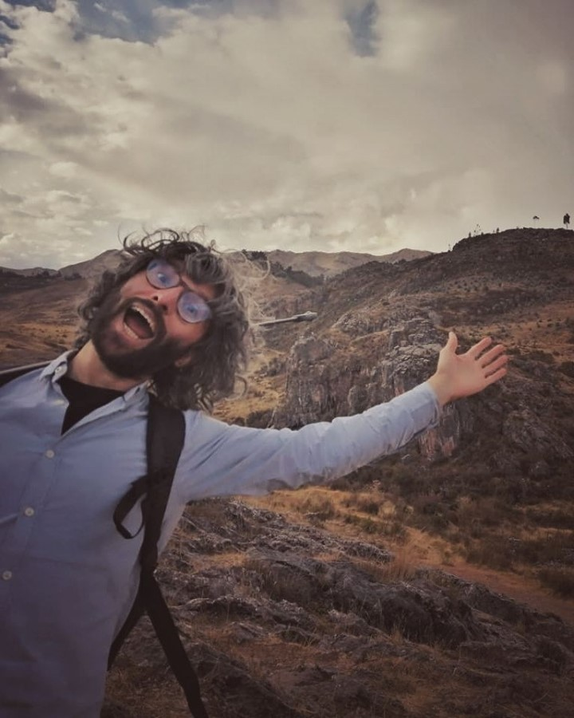
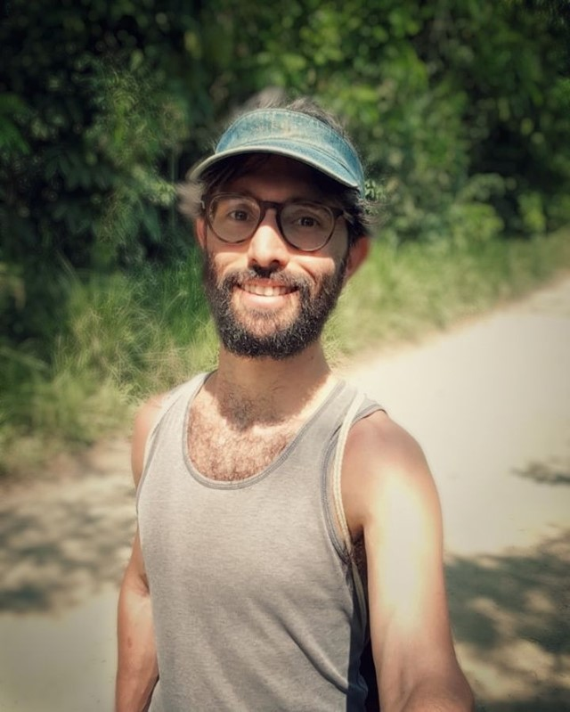

import { Age } from "~/components/age";
import coverImage from "./canrau-waving-in-front-of-andean-mountains.jpg";
import secondImage from "./canrau-smiling-on-rainforest-path.jpg";
export const cover = coverImage;
import pronunciation from "./can-rau_pronunciation.mp3";

export const jsonld = {
  "@context": "https://schema.org",
  "@type": "Article", // note: AboutPage not accepted by https://search.google.com/test/rich-results/
  headline: "Welcome to the digital garden of Can Rau",
  description: "Let me give you a little background story of myself.",
  primaryImageOfPage: {
    "@context": "https://schema.org",
    "@type": "ImageObject",
    contentUrl: coverImage,
    description:
      "Me waving & smiling hilariously into the cam, being way up in the andean mountains at more than 3000m",
  },
  image: [coverImage, secondImage],
  dateCreated: "2021-10-20T00:29:00 -5",
  datePublished: "2021-10-20T00:29:00 -5",
  dateModified: "2021-12-27T00:30:00 -5",
  author: [
    {
      "@type": "Person",
      name: "Can Rau",
      url: "https://twitter.com/CanRau",
      gender: "Male",
      birthDate: "1988-1-17",
      birthPlace: "Berlin, Germany",
    },
  ],
};

{/* export const meta = {cover}; */}

# {frontmatter.title} {/* todo: doesn't work with [rehype-extract-toc](https://github.com/stefanprobst/rehype-extract-toc) */}

 Photo by Judith 🥰 via [@fuckyeahgaiama](https://www.instagram.com/fuckyeahgaiama)

## Table of contents

👋 A warm welcome to everyone stumbling upon my website and especially this page 🤓

I want to use this first "article" to explain a little more what I'm planning to do here.

After a couple of intents to blog, on other domains, which, apart from my travel blog I had when I was work & traveling Australia, failed pretty quick. Actually I should say, I failed pretty quick to continue adding and updating content, so they went stale.

## What was the problem?

Good question! I'm not exactly sure, not even that I'm able to solve it this time, though it always felt like my websites were hindering or limiting me. They were always more specific, like traveling or coding, but kinda limited to a specific project. So when some desire to share something popped up which to my mind wasn't sufficiently related to the blogs topic I felt like I souldn't share it there but also had nowhere else to share. 😫

## So how do you intend to solve this?

Right now, this website is in its infancy, a living work in progress and at least at the moment it makes sense to me to keep it more programming related, as I want to share ["how I'm building it"](#roadmap).

As soon as it matures a little further and I get to implement categories and figure out how I wana structure everything I'm starting to share non-programming stuff. I hope by then I can settle on a CMS, or even build my own (which is another project I have in mind). I also want to start to translate at least parts of this website to spanish and maybe german as well.

As much as I feel like a coder, I'm also very visual and as fun as it is to write markdown (in VSCode at the time of writing) it kinda doesn't feel satisfying enough. Or maybe that's just because right now I still have to deploy the whole website to publish or update content. 🤷🏻‍♂️ Might very well be a combination of both.

Also I feel like I have ambitious plans for my content, which can definitely be done using markdown, but would be more fun using (custom) CMS 😍.

## Sounds kinda interesting, but who are you actually?? 🧐

{/* done: Make age a dynamic component */}

Right! So, as you might've guessed my name's Can Rau, I'm <Age year={1988} month={0} day={17} /> years old and was born and raised in Berlin, Germany, Hallo 👋.
I left Germany in 2013 to explore the world by bike and live now full-time in Perú 🇵🇪🦙 since december 2014 🎅
I just love the climate of a higher rainforest 🌴

Also I've co-founded a [rainforest conservation organization](https://www.instagram.com/fuckyeahgaiama) here to help protect some of the worlds precious wild lifes 🐒🦋🔐

 Photo by [@fuckyeahgaiama](https://www.instagram.com/fuckyeahgaiama)

## What's a digital garden though?

The idea is that it's more about living documents (pages) which grow over time and be updated.
That's why I'm planning to have the pages versioned so in the future you'll be able to view not only the current state, but also all the former versions 📜 as well as subscribe not only to the complete [newsletter](#newsletter) but also specific topics and documents, to get notified about document updates 🔔

I got the inspiration to a digital garden by [Joel Hooks](https://joelhooks.com/digital-garden) and later stumbled upon more examples by [Chris Biscardi](https://www.christopherbiscardi.com/what-is-a-digital-garden) and [Tom Critchlow](https://tomcritchlow.com/2018/10/10/of-gardens-and-wikis/), theres also a video by Chris Biscardi, Joel Hooks, Kurt Kemple and John Otander on [egghead.io](https://egghead.io/lessons/egghead-sector-the-future-of-mdx-and-digital-gardens)

## How to pronounce Can Rau?

{/* https://github.com/sindresorhus/stuff/ */}

I'm really glad you ask 🥰 My given name is actually turkish ([dʒan]), so no it's not pronounced like the english modal verb "can" or a can of tomatoes 🥫.

I was born a little earlier than expected and my parents didn't came up with a name yet 😅 As my turkish-born dad used to call me "my canım", yes that's an i without the dot, which translates to "my dear" or "my life", they figured why not just name me Can 🤷🏻‍♂️ which means: spirit, life, soul or heart.

There's also a [Wikipedia page](<https://en.wikipedia.org/wiki/Can_(name)>) for my name 😎

My surname on the other hand is german, which back then in Middle High German used to mean something like hairy, ragged or rough 😳😅

To answer the pronunciation question, I just recorded it to make it easier for everyone curious 🤓

<audio controls src={pronunciation} />

I'm actually a little "pronunciation nerd" 😇 more on that later though 👀

So, that's all for now, though remember that I'm coming back to update this very [welcome page](/en/welcome) whenever I see fit 😉

If you've got any questions, feedback or anything else, please feel free to message (and or follow me) on Twitter [@CanRau](https://twitter.com/CanRau)

See you hopefully soon, bye 👋
